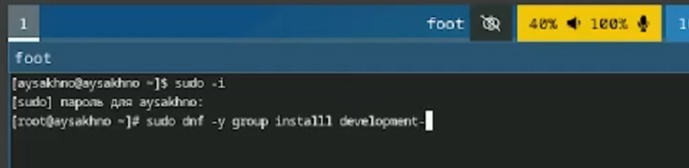
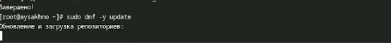
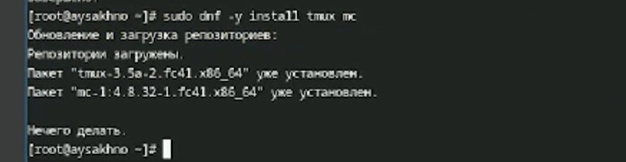
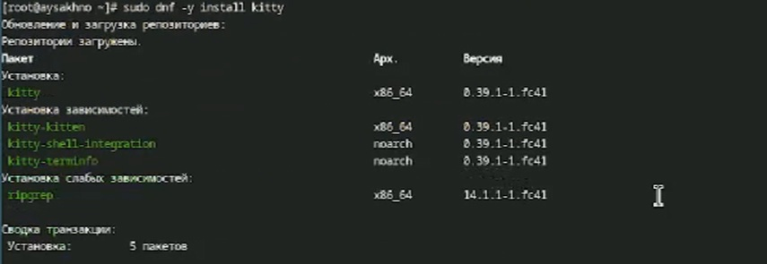
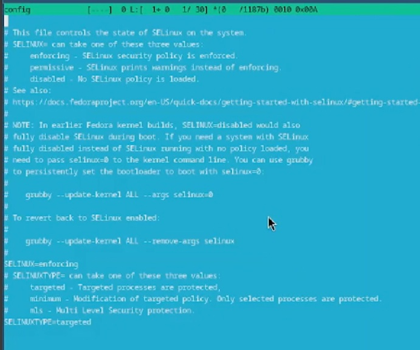
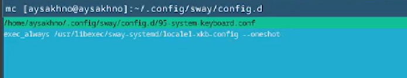
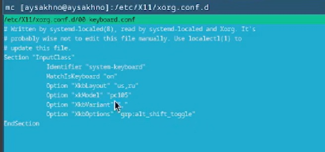
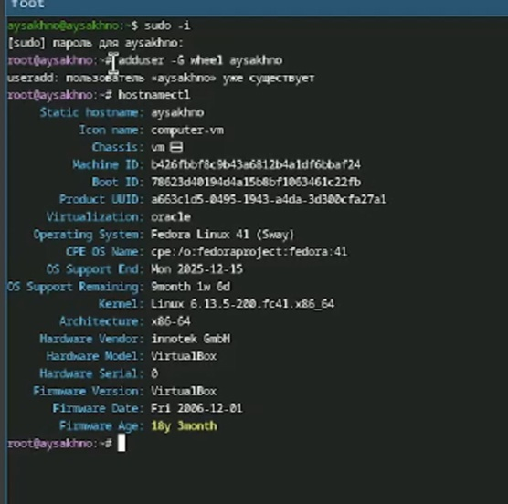
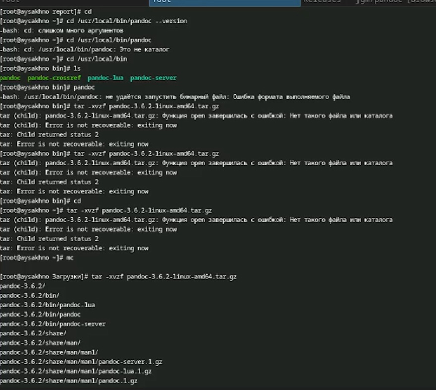
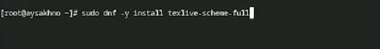

---
## Front matter
lang: ru-RU
title: Отчёт по лабораторной работе №1
subtitle: Операционные системы 
author:
  - Сахно Алёна Юрьевна
institute:
  - Российский университет дружбы народов, Москва, Россия
  - Объединённый институт ядерных исследований, Дубна, Россия
date: 07 марта 2025
  - НКАбд-04-24
## i18n babel
babel-lang: russian
babel-otherlangs: english

## Formatting pdf
toc: false
toc-title: Содержание
slide_level: 2
aspectratio: 169
section-titles: true
theme: metropolis
header-includes:
 - \metroset{progressbar=frametitle,sectionpage=progressbar,numbering=fraction}
---

# Информация

## преподаватель 

:::::::::::::: {.columns align=center}
::: {.column width="70%"}

  * Кулябов Дмитрий Сергеевич
  * д.ф.-м.н., профессор
  * профессор кафедры прикладной информатики и теории вероятностей
  * Российский университет дружбы народов
  * [kulyabov-ds@rudn.ru](mailto:kulyabov-ds@rudn.ru)
  * <https://yamadharma.github.io/ru/>

:::
::: {.column width="30%"}

:::
::::::::::::::

# Вводная часть

Лабораторная работа подразумевает установку на виртуальную машину VirtualBox (https://www.virtualbox.org/) операционной системы Linux (дистрибутив Fedora).
Выполнение работы возможно как в дисплейном классе факультета физико-математических и естественных наук РУДН, так и дома.
Описание выполнения работы приведено для дисплейного класса со следующими характеристиками техники

## Актуальность
- Получить новые знания 
- Установка  Linux на Virtualbox

## Объект и предмет исследования

- Объектом исследования является установка Linux на Virtualbox
- Предмет исследования является установка, настроука и изучение виртуалььной машины 

## Цели и задачи

#Цель

- Целью данной работы является приобретение практических навыков установки операционной системы на виртуальную машину,
настройки минимально необходимых для дальнейшей работы сервисов. 

# Задачи 
- Получите следующую информацию.

-Версия ядра Linux (Linux version).
- Частота процессора (Detected Mhz processor).
-  Модель процессора (CPU0).
-  Объём доступной оперативной памяти (Memory available).
- Тип обнаруженного гипервизора (Hypervisor detected).
-  Тип файловой системы корневого раздела.
-  Последовательность монтирования файловых систем.

## Выполнение лабараторной работы 

#После установки

:::::::::::::: {.columns align=center}
::: {.column width="10%"}

:::
::: {.column width="90%"}

:::
::::::::::::::

## Обновление 

:::::::::::::: {.columns align=center}
::: {.column width="10%"}

:::
::: {.column width="90%"}

:::
::::::::::::::

## Повышение комфорта работы

:::::::::::::: {.columns align=center}
::: {.column width="10%"}

::: 
::: {.column width="90%"}

:::
::::::::::::::

## Повышение комфорта работы

:::::::::::::: {.columns align=center}
::: {.column width="10%"}

::: 
::: {.column width="90%"}

:::
::::::::::::::

## Автоматическое обновление

:::::::::::::: {.columns align=center}
::: {.column width="30%"}

     * При необходимости можно использовать автоматическое обновление.

     *  Установка программного обеспечения
:::
::: {.column width="70%"}

:::
::::::::::::::

## Отключение SELinux 
:::::::::::::: {.columns align=center}
::: {.column width="10%"}

:::
::: {.column width="90%"}

:::
::::::::::::::

## Настройка раскладки клавиатуры

Отредактируйте конфигурационный файл  ~/.config/sway/config.d/95-system-keyboard-config.conf: 

- exec_always /usr/libexec/sway-systemd/locale1-xkb-config --oneshot

# Настройка раскладки клавиатуры

:::::::::::::: {.columns align=center}
::: {.column width="10%"}

:::
::: {.column width="90%"}

:::
::::::::::::::

# Отредактируйте конфигурационный файл 

:::::::::::::: {.columns align=center}
::: {.column width="10%"}

:::
::: {.column width="90%"}

:::
::::::::::::::

## Установка имени пользователя и названия хоста

:::::::::::::: {.columns align=center}
::: {.column width="10%"}

::: 
::: {.column width="90%"}

:::
::::::::::::::

## Работа с языком разметки Markdown

- Для работы с перекрёстными ссылками мы используем пакет pandoc-crossref.
-   Пакет pandoc-crossref в стандартном репозитории отсутствует.
-  Придётся ставить вручную, скачав с сайта .
- При установке pandoc-crossref следует обращать внимание, для какой версии pandoc он скомпилён.
- Лучше установить pandoc и pandoc-crossref вручную.
- Скачайте необходимую версию pandoc-crossref .
- Посмотрите, для какой версии откомпилён pandoc-crossref.
- Скачайте соответствующую версию pandoc 
- Распакуйте архивы.
- Обе программы собраны в виде статически-линкованных бинарных файлов.
- Поместите их в каталог /usr/local/bin.

# Работа с языком разметки Markdown

:::::::::::::: {.columns align=center}
::: {.column width="10%"}

:::
::: {.column width="90%"}

:::
::::::::::::::

## TEXLIVE

:::::::::::::: {.columns align=center}
::: {.column width="10%"}

:::
::: {.column width="90%"}

:::
::::::::::::::

## Результаты
- Я приобрела  практических навыков установки операционной системы на виртуальную машину, настройки минимально необходимых для дальнейшей работы сервисов.

::: incremental

:::

::: incremental

:::

::: incremental

:::

::: incremental

:::

