---
## Front matter
title: "Отчёта по лабораторной работе №1 "
subtitle: "Операуионные системы "
author: "Сахно Алёна Юрьевна "

## Generic otions
lang: ru-RU
toc-title: "Содержание"

## Bibliography
bibliography: bib/cite.bib
csl: pandoc/csl/gost-r-7-0-5-2008-numeric.csl

## Pdf output format
toc: true # Table of contents
toc-depth: 2
lof: true # List of figures
lot: true # List of tables
fontsize: 12pt
linestretch: 1.5
papersize: a4
documentclass: scrreprt
## I18n polyglossia
polyglossia-lang:
  name: russian
  options:
	- spelling=modern
	- babelshorthands=true
polyglossia-otherlangs:
  name: english
## I18n babel
babel-lang: russian
babel-otherlangs: english
## Fonts
mainfont: IBM Plex Serif
romanfont: IBM Plex Serif
sansfont: IBM Plex Sans
monofont: IBM Plex Mono
mathfont: STIX Two Math
mainfontoptions: Ligatures=Common,Ligatures=TeX,Scale=0.94
romanfontoptions: Ligatures=Common,Ligatures=TeX,Scale=0.94
sansfontoptions: Ligatures=Common,Ligatures=TeX,Scale=MatchLowercase,Scale=0.94
monofontoptions: Scale=MatchLowercase,Scale=0.94,FakeStretch=0.9
mathfontoptions:
## Biblatex
biblatex: true
biblio-style: "gost-numeric"
biblatexoptions:
  - parentracker=true
  - backend=biber
  - hyperref=auto
  - language=auto
  - autolang=other*
  - citestyle=gost-numeric
## Pandoc-crossref LaTeX customization
figureTitle: "Рис."
tableTitle: "Таблица"
listingTitle: "Листинг"
lofTitle: "Список иллюстраций"
lotTitle: "Список таблиц"
lolTitle: "Листинги"
## Misc options
indent: true
header-includes:
  - \usepackage{indentfirst}
  - \usepackage{float} # keep figures where there are in the text
  - \floatplacement{figure}{H} # keep figures where there are in the text
---

# Цель работы

Целью данной работы является приобретение практических навыков установки операционной системы на виртуальную машину, настройки минимально необходимых для дальнейшей работы сервисов.

# Задание

Дождитесь загрузки графического окружения и откройте терминал. В окне терминала проанализируйте последовательность загрузки системы, выполнив команду dmesg. Можно просто просмотреть вывод этой команды:

dmesg | less

Можно использовать поиск с помощью grep:

dmesg | grep -i "то, что ищем"

Получите следующую информацию.
   Версия ядра Linux (Linux version).
   Частота процессора (Detected Mhz processor).
   Модель процессора (CPU0).
   Объём доступной оперативной памяти (Memory available).
   Тип обнаруженного гипервизора (Hypervisor detected).
   Тип файловой системы корневого раздела.
   Последовательность монтирования файловых систем.

# Теоретическое введение
Техническое обеспечение

    Лабораторная работа подразумевает установку на виртуальную машину VirtualBox (https://www.virtualbox.org/) операционной системы Linux (дистрибутив Fedora).
    Выполнение работы возможно как в дисплейном классе факультета физико-математических и естественных наук РУДН, так и дома. Описание выполнения работы приведено для дисплейного класса со следующими характеристиками техники:
        Intel Core i3-550 3.2 GHz, 4 GB оперативной памяти, 80 GB свободного места на жёстком диске;
        ОС Linux Gentoo (http://www.gentoo.ru/);
        VirtualBox версии 7.0 или новее.
    Для установки в виртуальную машину используется дистрибутив Linux Fedora (https://getfedora.org), вариант с менеджером окон sway (https://fedoraproject.org/spins/sway/).
    При выполнении лабораторной работы на своей технике вам необходимо скачать необходимый образ операционной системы (https://fedoraproject.org/spins/sway/download/index.html).
    В дисплейных классах можно воспользоваться образом в каталоге /afs/dk.sci.pfu.edu.ru/common/files/iso.
    Для определённости в описании будем использовать версию Fedora-Sway-Live-x86_64-41-1.4.iso.

# Выполнение лабораторной работы

**После установки**

-  Войдите в ОС под заданной вами при установке учётной записью.
- Нажмите комбинацию Win+Enter для запуска терминала.

 Переключитесь на роль супер-пользователя:

 sudo -i

 (рис. [-@fig:001]).

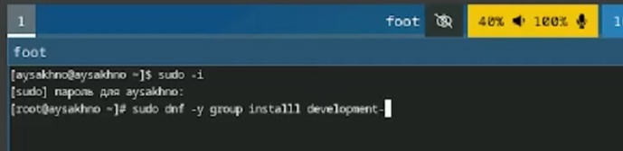{#fig:001 width=70%}

**Обновления**

Установите средства разработки:

sudo dnf -y group install development-tools

Обновить все пакеты

sudo dnf -y update

 (рис. [-@fig:002]).

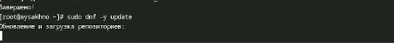{#fig:002 width=70%}

**Повышение комфорта работы**

- Программы для удобства работы в консоли:

 sudo dnf -y install tmux mc

 - Другой вариант консоли:

 sudo dnf -y install kitty

 (рис. [-@fig:003]).

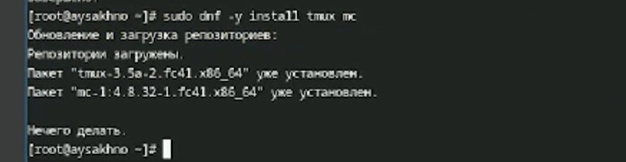{#fig:003 width=70%}

 (рис. [-@fig:004]).

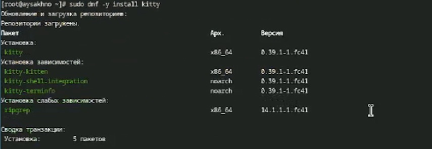{#fig:004 width=70%}

**Автоматическое обновление**

- При необходимости можно использовать автоматическое обновление.

-  Установка программного обеспечения:

sudo dnf -y install dnf-automatic

 (рис. [-@fig:005]).

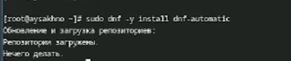{#fig:005 width=70%}

- Задаёте необходимую конфигурацию в файле /etc/dnf/automatic.conf.

- Запустите таймер:

sudo systemctl enable --now dnf-automatic.timer

**Отключение SELinux**

 В данном курсе мы не будем рассматривать работу с системой безопасности SELinux.
    Поэтому отключим его.

    В файле /etc/selinux/config замените значение

    SELINUX=enforcing

    на значение

    SELINUX=permissive

    Перегрузите виртуальную машину:

    sudo systemctl reboot

    В данном курсе мы не будем рассматривать работу с системой безопасности SELinux.
    Поэтому отключим его.

    В файле /etc/selinux/config замените значение

    SELINUX=enf
    на значение

    SELINUX=permissive

    Перегрузите виртуальную машину:

    sudo systemctl reboot

 (рис. [-@fig:010]).

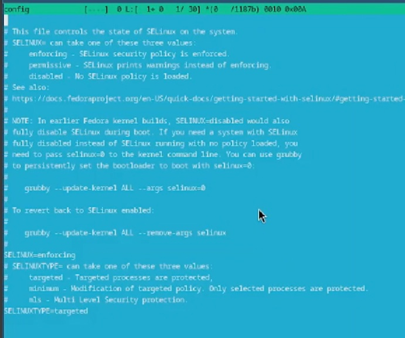{#fig:010 width=70%}

**Настройка раскладки клавиатуры**

    Войдите в ОС под заданной вами при установке учётной записью.
    Нажмите комбинацию Win+Enter для запуска терминала.

    Запустите терминальный мультиплексор tmux:

    tmux

    Создайте конфигурационный файл ~/.config/sway/config.d/95-system-keyboard-config.conf:

    mkdir -p ~/.config/sway
    touch ~/.config/sway/config.d/95-system-keyboard-config.conf

    Отредактируйте конфигурационный файл ~/.config/sway/config.d/95-system-keyboard-config.conf:

    exec_always /usr/libexec/sway-systemd/locale1-xkb-config --oneshot

 (рис. [-@fig:007]).

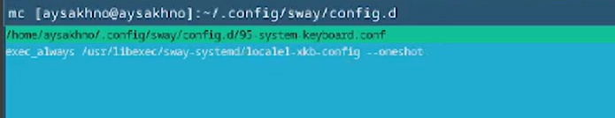{#fig:007 width=70%}

    Переключитесь на роль супер-пользователя:

    sudo -i

    Отредактируйте конфигурационный файл /etc/X11/xorg.conf.d/00-keyboard.conf:

    Section "InputClass"
                Identifier "system-keyboard"
                MatchIsKeyboard "on"
                Option "XkbLayout" "us,ru"
                Option "XkbVariant" ",winkeys"
                Option "XkbOptions" "grp:rctrl_toggle,compose:ralt,terminate:ctrl_alt_bksp"
    EndSection

    Для этого можно использовать файловый менеджер mc и его встроенный редактор.

    Перегрузите виртуальную машину:

    sudo systemctl reboot

 (рис. [-@fig:008]).

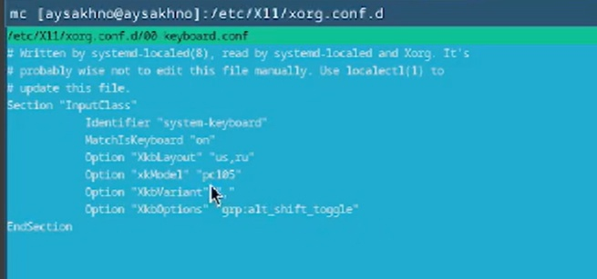{#fig:008 width=70%}

**Установка имени пользователя и названия хоста**

    Если при установке виртуальной машины вы задали имя пользователя или имя хоста, не удовлетворяющее соглашению об именовании, то вам необходимо исправить это.
    Запустите виртуальную машину и залогиньтесь.
    Нажмите комбинацию Win+Enter для запуска терминала.

    Запустите терминальный мультиплексор tmux:

    tmux

    Переключитесь на роль супер-пользователя:

    sudo -i

    Создайте пользователя (вместо username укажите ваш логин в дисплейном классе):

    adduser -G wheel username

    Задайте пароль для пользователя (вместо username укажите ваш логин в дисплейном классе):

    passwd username

    Установите имя хоста (вместо username укажите ваш логин в дисплейном классе):

    hostnamectl set-hostname username

    Проверьте, что имя хоста установлено верно:

    hostnamectl

(рис. [-@fig:011]).

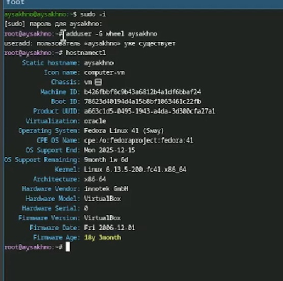{#fig:011 width=70%}

**Установка программного обеспечения для создания документации**

    Нажмите комбинацию Win+Enter для запуска терминала.

    Запустите терминальный мультиплексор tmux:

    tmux

    Переключитесь на роль супер-пользователя:

    sudo -i

**Работа с языком разметки Markdown**

    Средство pandoc для работы с языком разметки Markdown.

    Установка с помощью менеджера пакетов:

    sudo dnf -y install pandoc

    Для работы с перекрёстными ссылками мы используем пакет pandoc-crossref.
        Пакет pandoc-crossref в стандартном репозитории отсутствует.
        Придётся ставить вручную, скачав с сайта https://github.com/lierdakil/pandoc-crossref.
        При установке pandoc-crossref следует обращать внимание, для какой версии pandoc он скомпилён.
    Лучше установить pandoc и pandoc-crossref вручную.
        Скачайте необходимую версию pandoc-crossref (https://github.com/lierdakil/pandoc-crossref/releases).
        Посмотрите, для какой версии откомпилён pandoc-crossref.
        Скачайте соответствующую версию pandoc (https://github.com/jgm/pandoc/releases).
        Распакуйте архивы.
        Обе программы собраны в виде статически-линкованных бинарных файлов.
        Поместите их в каталог /usr/local/bin.

(рис. [-@fig:006]).

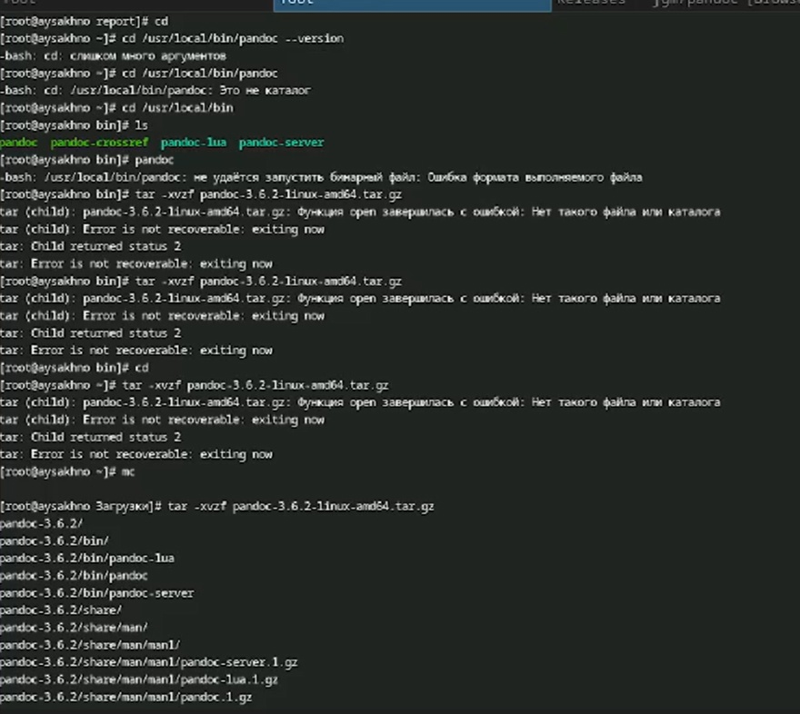{#fig:006 width=70%}

**texlive**

    Установим дистрибутив TeXlive:

    sudo dnf -y install texlive-scheme-full

(рис. [-@fig:009]).

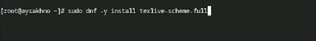{#fig:009  width=70%}
# Выводы

Я приобрела  практических навыков установки операционной системы на виртуальную машину, настройки минимально необходимых для дальнейшей работы сервисов.

# Список литературы{.unnumbered}

::: {#refs} https://esystem.rudn.ru/mod/page/view.php?id=1224368
:::
