---
## Front matter
lang: ru-RU
title: Отчет по лабораторной работе №2
subtitle: Операционные системы
author:
  - Сахно Алёна Юрьевна
institute:
  - Российский университет дружбы народов, Москва, Россия
  - Объединённый институт ядерных исследований, Дубна, Россия
date: 07.03.25
  - НКАбд-04-24
## i18n babel
babel-lang: russian
babel-otherlangs: english

## Formatting pdf
toc: false
toc-title: Содержание
slide_level: 2
aspectratio: 169
section-titles: true
theme: metropolis
header-includes:
 - \metroset{progressbar=frametitle,sectionpage=progressbar,numbering=fraction}
---

# Информация

## Преподаватель

:::::::::::::: {.columns align=center}
::: {.column width="70%"}

  * Кулябов Дмитрий Сергеевич
  * д.ф.-м.н., профессор
  * профессор кафедры прикладной информатики и теории вероятностей
  * Российский университет дружбы народов
  * [kulyabov-ds@rudn.ru](mailto:kulyabov-ds@rudn.ru)
  * <https://yamadharma.github.io/ru/>

:::
::: {.column width="30%"}

:::
::::::::::::::

# Вводная часть

Системы контроля версий (Version Control System, VCS) применяются при работе нескольких человек над одним проектом. Обычно основное дерево проекта хранится в локальном или удалённом репозитории, к которому настроен доступ для участников проекта. При внесении изменений в содержание проекта система контроля версий позволяет их фиксировать, совмещать изменения, произведённые разными участниками проекта, производить откат к любой более ранней версии проекта, если это требуется.

## Актуальность 

- Рассмотрим примеры использования git
- Изучим основные команды git
- Научимся создавать ключи (SSH / PGP)

## Объект и предмет исследования

- Объектом исследования являетсся системы контроля версий
- предмет исследования является git

## Цели 

- Изучить идеологию и применение средств контроля версий.
- Освоить умения по работе с git.

## Задачи 

    Создать базовую конфигурацию для работы с git.
    Создать ключ SSH.
    Создать ключ PGP.
    Настроить подписи git.
    Зарегистрироваться на Github.
    Создать локальный каталог для выполнения заданий по предмету.

##  Выполнение лабораторной работы
# Установка программного обеспечения

:::::::::::::: {.columns align=center}
::: {.column width="50%"}

   * Для начала переходим в супер пользователь и устанавливаем git
   * Также воспроизводим установку gh

:::
::: {.column width="50%"}

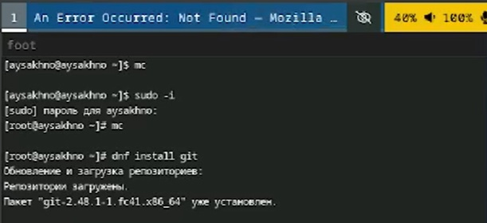

:::
::::::::::::::

# Установка программного обеспечения

:::::::::::::: {.columns align=center}
::: {.column width="50%"}

:::
::: {.column width="50%"}

:::
::::::::::::::

# Базовая настройка git

:::::::::::::: {.columns align=center}
::: {.column width="50%"}

:::
::: {.column width="50%"}

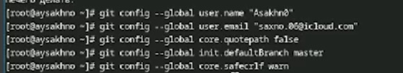

:::
::::::::::::::

## Создайте ключи ssh

:::::::::::::: {.columns align=center}
::: {.column width="50%"}

:::
::: {.column width="50%"}

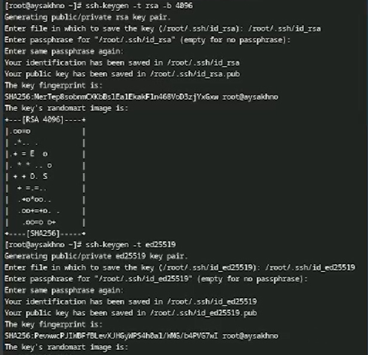

:::
::::::::::::::

## Создайте ключи pgp

И переходим к созданию ключя pgp
генерируя ключ, из предложенных опций выбираем :
1. тип RSA and RSA
2. размер 4096
3. срок действия 0
4. GPG запросит личную информацию , которая сохранится в ключе

# Создайте ключи pgp

:::::::::::::: {.columns align=center}
::: {.column width="50%"}

:::
::: {.column width="50%"}

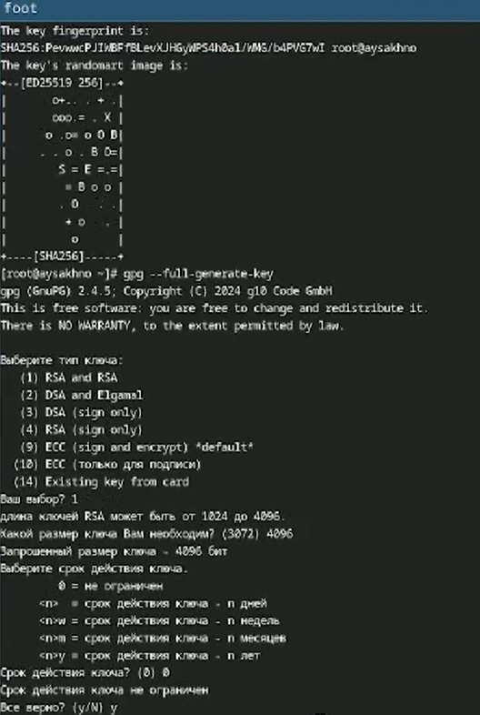

:::
::::::::::::::

## Настройка github
# Добавление PGP ключа в GitHub

:::::::::::::: {.columns align=center}
::: {.column width="50%"}

:::
::: {.column width="50%"}

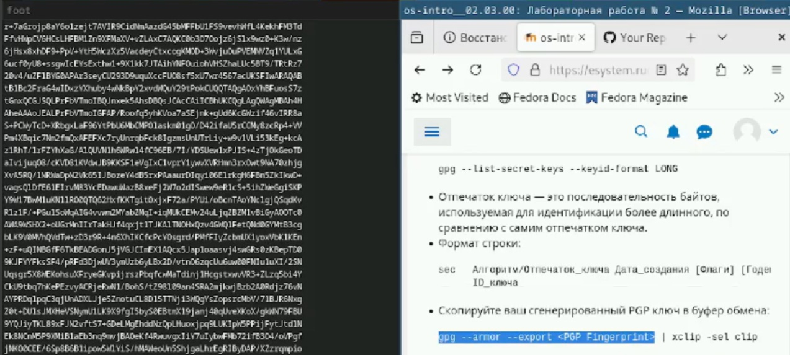

:::
::::::::::::::

# Добавление PGP ключа в GitHub

:::::::::::::: {.columns align=center}
::: {.column width="50%"}

:::
::: {.column width="50%"}

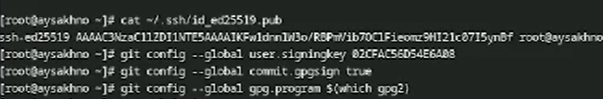

:::
::::::::::::::

# Добавление PGP ключа в GitHub

:::::::::::::: {.columns align=center}
::: {.column width="30%"}

   * В GitHub  отображения созданных ключей
:::
::: {.column width="70%"}

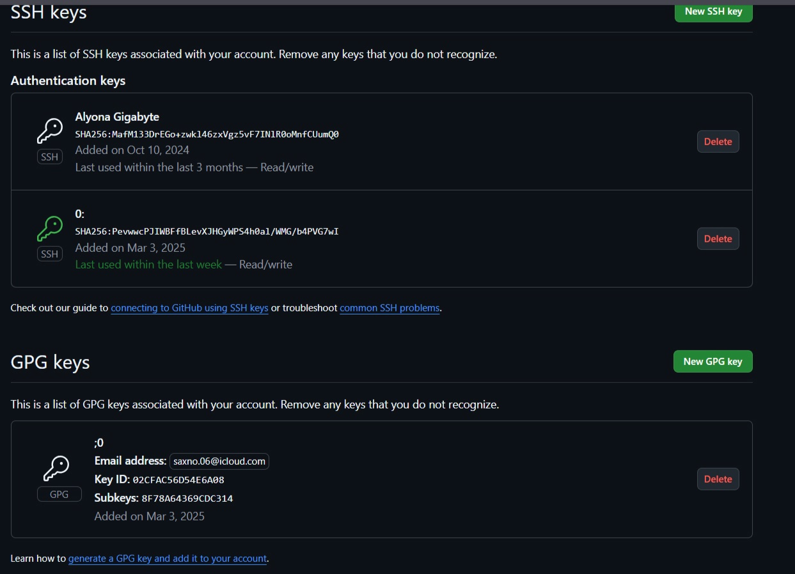

:::
::::::::::::::

## Настройка gh

:::::::::::::: {.columns align=center}
::: {.column width="50%"}

:::
::: {.column width="50%"}

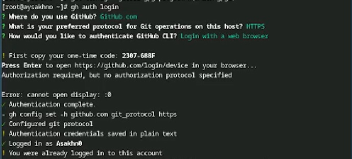

:::
::::::::::::::

## Сознание репозитория курса на основе шаблона

:::::::::::::: {.columns align=center}
::: {.column width="30%"}
    
    * Настройка для рабочего пространства
    * Это создание репозитория курса на основе шаблона
:::
::: {.column width="70%"}

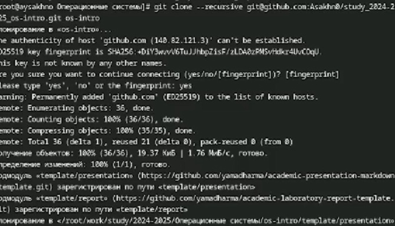

:::
::::::::::::::

## Настройка каталога курса

:::::::::::::: {.columns align=center}
::: {.column width="50%"}

:::
::: {.column width="50%"}

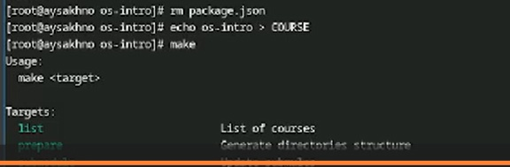

:::
::::::::::::::

## Настройка каталога курса

:::::::::::::: {.columns align=center}
::: {.column width="50%"}

:::
::: {.column width="50%"}

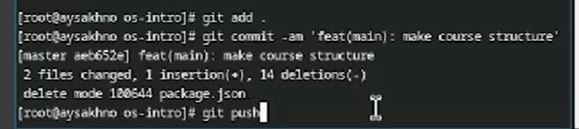

:::
::::::::::::::

## Вывод 

 Я изучила идеологию и применение средств контроля версий и освоила умения по работе с git.

::: incremental

:::

::: incremental

:::

::: incremental

:::

::: incremental

:::

