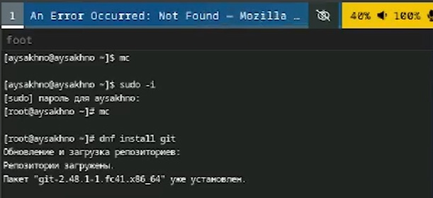
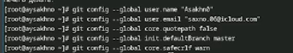
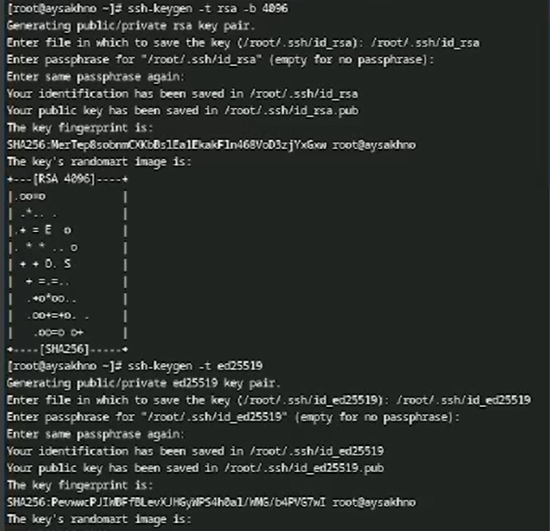
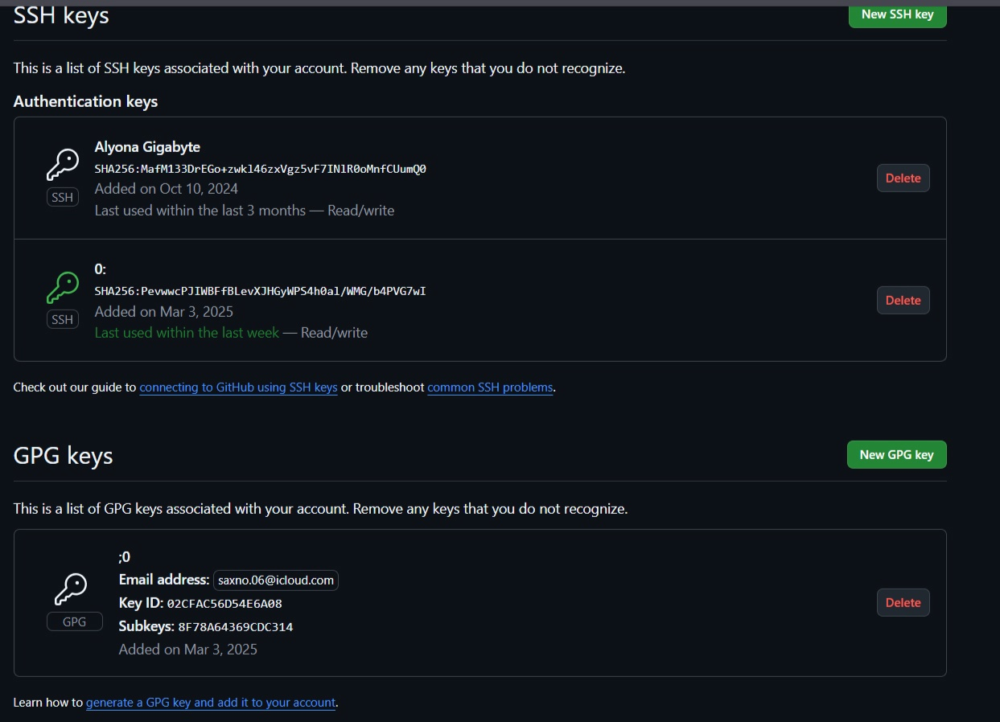
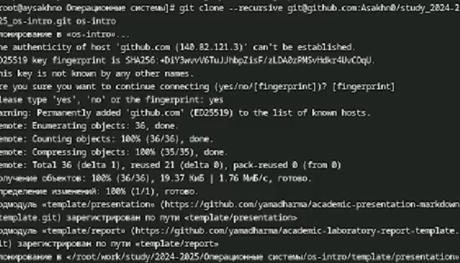
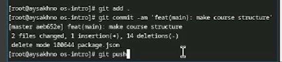

---
## Front matter
title: "Отчёта по лабораторной работе №2"
subtitle: "Операционные системы"
author: "Сахно Алёна Юрьевна"

## Generic otions
lang: ru-RU
toc-title: "Содержание"

## Bibliography
bibliography: bib/cite.bib
csl: pandoc/csl/gost-r-7-0-5-2008-numeric.csl

## Pdf output format
toc: true # Table of contents
toc-depth: 2
lof: true # List of figures
lot: true # List of tables
fontsize: 12pt
linestretch: 1.5
papersize: a4
documentclass: scrreprt
## I18n polyglossia
polyglossia-lang:
  name: russian
  options:
	- spelling=modern
	- babelshorthands=true
polyglossia-otherlangs:
  name: english
## I18n babel
babel-lang: russian
babel-otherlangs: english
## Fonts
mainfont: IBM Plex Serif
romanfont: IBM Plex Serif
sansfont: IBM Plex Sans
monofont: IBM Plex Mono
mathfont: STIX Two Math
mainfontoptions: Ligatures=Common,Ligatures=TeX,Scale=0.94
romanfontoptions: Ligatures=Common,Ligatures=TeX,Scale=0.94
sansfontoptions: Ligatures=Common,Ligatures=TeX,Scale=MatchLowercase,Scale=0.94
monofontoptions: Scale=MatchLowercase,Scale=0.94,FakeStretch=0.9
mathfontoptions:
## Biblatex
biblatex: true
biblio-style: "gost-numeric"
biblatexoptions:
  - parentracker=true
  - backend=biber
  - hyperref=auto
  - language=auto
  - autolang=other*
  - citestyle=gost-numeric
## Pandoc-crossref LaTeX customization
figureTitle: "Рис."
tableTitle: "Таблица"
listingTitle: "Листинг"
lofTitle: "Список иллюстраций"
lotTitle: "Список таблиц"
lolTitle: "Листинги"
## Misc options
indent: true
header-includes:
  - \usepackage{indentfirst}
  - \usepackage{float} # keep figures where there are in the text
  - \floatplacement{figure}{H} # keep figures where there are in the text
---

# Цель работы

    Изучить идеологию и применение средств контроля версий.
    Освоить умения по работе с git.

# Задание

    Создать базовую конфигурацию для работы с git.
    Создать ключ SSH.
    Создать ключ PGP.
    Настроить подписи git.
    Зарегистрироваться на Github.
    Создать локальный каталог для выполнения заданий по предмету.

# Теоретическое введение
Примеры использования git

    Система контроля версий Git представляет собой набор программ командной строки. Доступ к ним можно получить из терминала посредством ввода команды git с различными опциями.
    Благодаря тому, что Git является распределённой системой контроля версий, резервную копию локального хранилища можно сделать простым копированием или архивацией.

Стандартные процедуры работы при наличии центрального репозитория

    Работа пользователя со своей веткой начинается с проверки и получения изменений из центрального репозитория (при этом в локальное дерево до начала этой процедуры не должно было вноситься изменений):

    git checkout master
    git pull
    git checkout -b имя_ветки

Работа с локальным репозиторием

    Создадим локальный репозиторий.

    Сначала сделаем предварительную конфигурацию, указав имя и email владельца репозитория:

    git config --global user.name "Имя Фамилия"
    git config --global  user.email "work@mail"

Работа с сервером репозиториев

    Для последующей идентификации пользователя на сервере репозиториев необходимо сгенерировать пару ключей (приватный и открытый):

    ssh-keygen -C "Имя Фамилия <work@mail>"

    Ключи сохраняться в каталоге ~/.ssh/.
Базовая настройка git

Первичная настройка параметров git

    Зададим имя и email владельца репозитория:

    git config --global user.name "Name Surname"
    git config --global user.email "work@mail"

    Настроим utf-8 в выводе сообщений git:

    git config --global core.quotepath false

    Настройте верификацию и подписание коммитов git.

    Зададим имя начальной ветки (будем называть её master):

    git config --global init.defaultBranch master

Учёт переносов строк

    В разных операционных системах приняты разные символы для перевода строк:
        Windows: \r\n (CR и LF);
        Unix: \n (LF);
        Mac: \r (CR).
Верификация коммитов с помощью PGP

    Как настроить PGP-подпись коммитов с помощью gpg.

Общая информация

    Коммиты имеют следующие свойства:
        author (автор) — контрибьютор, выполнивший работу (указывается для справки);
        committer (коммитер) — пользователь, который закоммитил изменения.
    Эти свойства можно переопределить при совершении коммита.
    Авторство коммита можно подделать.
    В git есть функция подписи коммитов.
    Для подписывания коммитов используется технология PGP (см. Работа с PGP).
    Подпись коммита позволяет удостовериться в том, кто является коммитером. Авторство не проверяется.
Проверка коммитов в Git

    GitHub и GitLab будут показывать значок Verified рядом с вашими новыми коммитами.

Режим бдительности (vigilant mode)

    На GitHub есть настройка vigilant mode.
    Все неподписанные коммиты будут явно помечены как Unverified.
    Включается это в настройках в разделе SSH and GPG keys. Установите метку на Flag unsigned commits as unverified.

# Выполнение лабораторной работы
Для начала переходим в супер пользователь и устанавливаем git, а также воспроизводим установку gh
 (рис.1 [-@fig:001]).

{#fig:001 width=70%}

 (рис.2 [-@fig:002]).

{#fig:002 width=70%}

После чего переходим к разделу Базовая настройка git 
1. задаем наше имя и email репозитория 
2. Настроим utf.8, задаем имя начальной ветки 

 (рис.3 [-@fig:003]).

{#fig:003 width=70%}
 
Создаем ключи ssh
По алгоритму rsa с ключем размером 4096 и по алгоритму ed25519

 (рис.4 [-@fig:004]).

{#fig:004 width=70%}

И переходим к созданию ключя pgp
генерируя ключ, из предложенных опций выбираем :
1. тип RSA and RSA
2. размер 4096
3. срок действия 0
4. GPG запросит личную информацию , которая сохранится в ключе 

 (рис.5	[-@fig:005]).

{#fig:005 width=70%}

Затем переходим к добавления PGP ключча в GitHub
Выполняя команды выводим список ключей , после чего на экран выйдетт сам ключ , мы должны его скопировать и перенести в ГитХабе
SSH добавляется в GitHub таким же образом как и pgp
Настройка автоматических подписей коммитетов git 
Используя введенную почту , указываем git применять его при подписи коммитетов 
 (рис.6	[-@fig:006]).

{#fig:006 width=70%}

 (рис.7	[-@fig:007.]).

{#fig:007 width=70%}

В GitHub  отображения созданных ключей 

 (рис.8	[-@fig:007]).

{#fig:008 width=70%}

Настройка gh
Для начало необходимо авторизоваться и утилита задаст несколько наводящих вопросов 

 (рис.9	[-@fig:008]).

{#fig:009 width=70%}

Настройка для рабочего пространства 
Это создание репозитория курса на основе шаблона 

 (рис.10	[-@fig:009]).

{#fig:010 width=70%}

Настройка каталога курса 
Передем в каталог курса , удалим лишние файлы , создаем необходимые каталоги и отправляем файлы на север 

 (рис.11	[-@fig:011]).

{#fig:011 width=70%}
 

 (рис.12	[-@fig:012]).

{#fig:012 width=70%}
# Выводы

 Я изучила идеологию и применение средств контроля версий и освоила умения по работе с git.

# Список литературы{.unnumbered}

::: {#refs} https://esystem.rudn.ru/mod/page/view.php?id=1224371
:::
