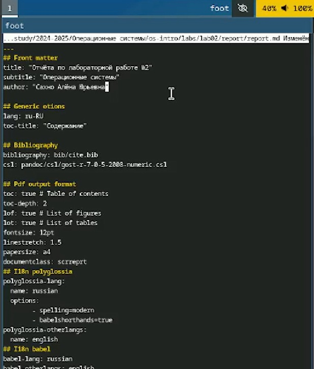
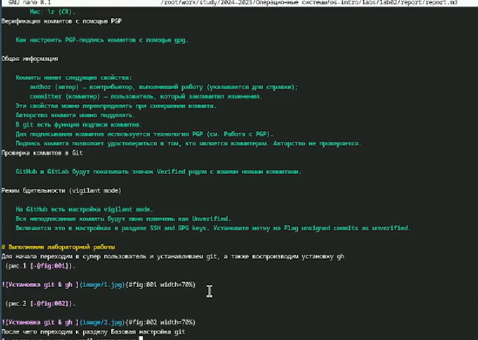
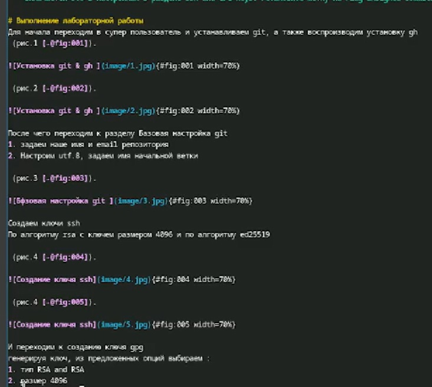
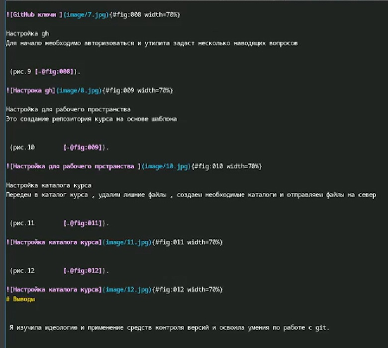
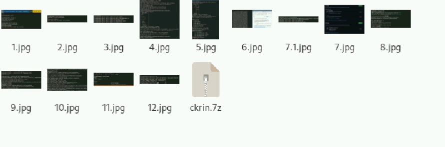
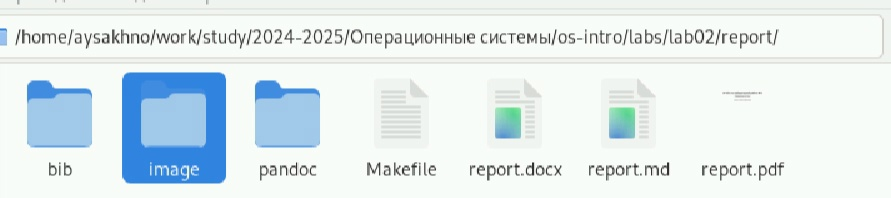

---
## Front matter
lang: ru-RU
title: Отчёта по лабораторной работе № 3
subtitle: Операционные системы"
author:
  - Сахно Алёна Юрьевна 
institute:
  - Российский университет дружбы народов, Москва, Россия
  - Объединённый институт ядерных исследований, Дубна, Россия
date: 07.03.25
  - НКАбд-04-24

## i18n babel
babel-lang: russian
babel-otherlangs: english

## Formatting pdf
toc: false
toc-title: Содержание
slide_level: 2
aspectratio: 169
section-titles: true
theme: metropolis
header-includes:
 - \metroset{progressbar=frametitle,sectionpage=progressbar,numbering=fraction}
---

# Информация

## Преподаватель

:::::::::::::: {.columns align=center}
::: {.column width="70%"}

  * Кулябов Дмитрий Сергеевич
  * д.ф.-м.н., профессор
  * профессор кафедры прикладной информатики и теории вероятностей
  * Российский университет дружбы народов
  * [kulyabov-ds@rudn.ru](mailto:kulyabov-ds@rudn.ru)
  * <https://yamadharma.github.io/ru/>

:::
::: {.column width="30%"}

:::
::::::::::::::

# Вводная часть

## Актуальность

- Данная нам лабораторная работа научит нас правильно оформлять Markdown.

## Объект и предмет исследования

- Объект исследование является Markdown.
- Предмет исследования является изучени оформления Markdown.

## Цели 
Научиться оформлять отчёты с помощью легковесного языка разметки Markdown.

## Задачи

  - Сделайте отчёт по предыдущей лабораторной работе в формате Markdown.
  - В качестве отчёта просьба предоставить отчёты в 3 форматах: pdf, docx и md (в архиве,
поскольку он должен содержать скриншоты, Makefile и т.д.)

## Теоретическое введение
Чтобы задать для текста полужирное начертание, заключите его в двойные звездочки:
**привет**

Чтобы задать для текста курсивное начертание, заключите его в одинарные звездочки:
*пока*

Чтобы задать для текста полужирное и курсивное начертание, заключите его в тройные
звездочки:
***как дела***

Неупорядоченный (маркированный) список можно отформатировать с помощью звездочек или тире:
- Соня
- Маша
- Лиза

Упорядоченный список можно отформатировать с помощью соответствующих цифр:
1. Вика
1. Настя
1. Данил

##  Выполнение лабораторной работы
:::::::::::::: {.columns align=center}
::: {.column width="50%"}
  * Для начла мы прописываем  название отчёта , имя автора , подзаголовок 
:::
::: {.column width="50%"}

:::
::::::::::::::

# Теоретическое введение

:::::::::::::: {.columns align=center}
::: {.column width="50%"}
:::
::: {.column width="50%"}

:::
::::::::::::::

#  Выполнение лабораторной работы

Выполение лабораторная работы мы прописываем пошагавое действие своей работы и прикладываем фотоотчет с результатом

::::::::::::: {.columns align=center}
::: {.column width="50%"}
:::
::: {.column width="50%"}

:::
::::::::::::::

## Раздел вывод
::::::::::::: {.columns align=center}
::: {.column width="50%"}
:::
::: {.column width="50%"}

:::
::::::::::::::

## Папка image

::::::::::::: {.columns align=center}
::: {.column width="50%"}
:::
::: {.column width="50%"}

:::
::::::::::::::

## Файлы pdf,md, docx 

::::::::::::: {.columns align=center}
::: {.column width="50%"}
:::
::: {.column width="50%"}

:::
::::::::::::::

## Вывод

Я научилась оформлять отчёты с помощью легковесного языка разметки Markdown

::: incremental

:::

::: incremental

:::

::: incremental

:::

::: incremental

:::

