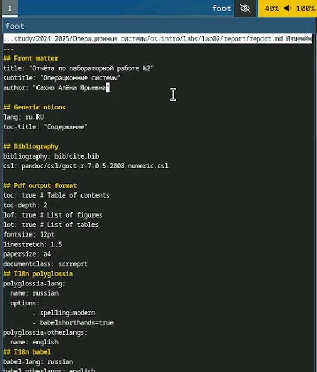
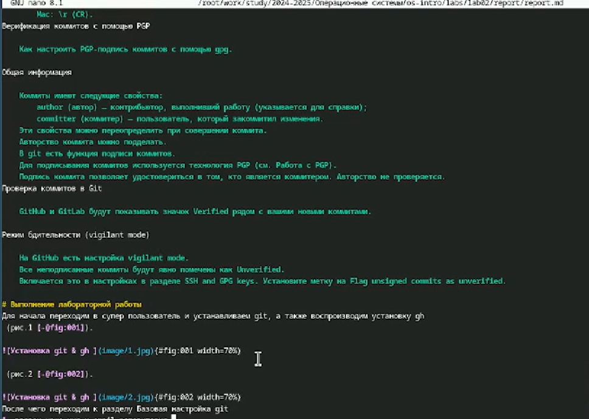

---
## Front matter
title: "Отчёта по лабораторной работе №2"
subtitle: "Операционные системы"
author: "Сахно Алёна Юрьевна"

## Generic otions
lang: ru-RU
toc-title: "Содержание"

## Bibliography
bibliography: bib/cite.bib
csl: pandoc/csl/gost-r-7-0-5-2008-numeric.csl

## Pdf output format
toc: true # Table of contents
toc-depth: 2
lof: true # List of figures
lot: true # List of tables
fontsize: 12pt
linestretch: 1.5
papersize: a4
documentclass: scrreprt
## I18n polyglossia
polyglossia-lang:
  name: russian
  options:
       	- spelling=modern
       	- babelshorthands=true
polyglossia-otherlangs:
  name: english
## I18n babel
babel-lang: russian
babel-otherlangs: english
## Fonts
mainfont: IBM Plex Serif
romanfont: IBM Plex Serif
sansfont: IBM Plex Sans
monofont: IBM Plex Mono
mathfont: STIX Two Math
mainfontoptions: Ligatures=Common,Ligatures=TeX,Scale=0.94
romanfontoptions: Ligatures=Common,Ligatures=TeX,Scale=0.94
sansfontoptions: Ligatures=Common,Ligatures=TeX,Scale=MatchLowercase,Scale=0.94
monofontoptions: Scale=MatchLowercase,Scale=0.94,FakeStretch=0.9
mathfontoptions:
## Biblatex
biblatex: true
biblio-style: "gost-numeric"
biblatexoptions:
  - parentracker=true
  - backend=biber
  - hyperref=auto
  - language=auto
  - autolang=other*
  - citestyle=gost-numeric
## Pandoc-crossref LaTeX customization
figureTitle: "Рис."
tableTitle: "Таблица"
listingTitle: "Листинг"
lofTitle: "Список иллюстраций"
lotTitle: "Список таблиц"
lolTitle: "Листинги"
## Misc options
indent: true
header-includes:
  - \usepackage{indentfirst}
  - \usepackage{float} # keep figures where there are in the text
  - \floatplacement{figure}{H} # keep figures where there are in the text
---

# Цель работы

Научиться оформлять отчёты с помощью легковесного языка разметки Markdown.

# Задание
  - Сделайте отчёт по предыдущей лабораторной работе в формате Markdown.
  - В качестве отчёта просьба предоставить отчёты в 3 форматах: pdf, docx и md (в архиве,
поскольку он должен содержать скриншоты, Makefile и т.д.)

# Теоретическое введение

Чтобы задать для текста полужирное начертание, заключите его в двойные звездочки:
**привет**

Чтобы задать для текста курсивное начертание, заключите его в одинарные звездочки:
*пока*

Чтобы задать для текста полужирное и курсивное начертание, заключите его в тройные
звездочки:
***как дела***

Неупорядоченный (маркированный) список можно отформатировать с помощью звездочек или тире:
- Соня
- Маша
- Лиза

Упорядоченный список можно отформатировать с помощью соответствующих цифр:
1. Вика
1. Настя
1. Данил

# Выполнение лабораторной работы
Для начла мы прописываем  название отчёта , имя  и тп 

После чего  мы прописываем теоретическое введение, можно взять основную	информацию с туиса.

(рис. [-@fig:001]).
{#fig:001 width=70%}

(рис. [-@fig:002]).
{#fig:002 width=70%}

Выполение лабораторная работы мы прописываем пошагавое действие своей работы и прикладываем фотоотчет с результатом 

(рис. [-@fig:003]).
{#fig:003  width=70%}

После того как мы прописали выполнение лабораторной работе переходим к разделу вывод ,где прописываем  к чему мы пришли и удалось ли нам выполнить цель работы 
 
(рис. [-@fig:004]).
{#fig:004  width=70%}

Для того чтобы у нас появились фотографии в отчёте мы изночально добавляем в папку image ,можно назвать фотографии как удобно вам

(рис. [-@fig:005]).
{#fig:005  width=70%}

Когда сделаем отчет то нам надо будет создать файлы pdf,md, docx . Чтобы их создать прописываем команду make , вслучае если у нас допушена ошибка , то файлы не будут созданы , либо есть не глобальная ошибка,но при этом файл pdf не будет создан , то можем применить команду make clean , она удалит эти фалы .
И в самом конце мы закидываем в github

(рис. [-@fig:006]).
{#fig:006  width=70%}

# Выводы
Я научилась оформлять отчёты с помощью легковесного языка разметки Markdown

# Список литературы{.unnumbered}

::: {#refs} https://esystem.rudn.ru/mod/page/view.php?id=1224371
::: 
