---
## Front matter
lang: ru-RU
title: Отчёта по лабораторной работе № 4 
subtitle: Операционные системы  
author:
  - Сахно Алёна Юрьевна 
  - НКАбд-04-24
institute:
  - Российский университет дружбы народов, Москва, Россия
  - Объединённый институт ядерных исследований, Дубна, Россия
date: 07 марта 2025

## i18n babel
babel-lang: russian
babel-otherlangs: english

## Formatting pdf
toc: false
toc-title: Содержание
slide_level: 2
aspectratio: 169
section-titles: true
theme: metropolis
header-includes:
 - \metroset{progressbar=frametitle,sectionpage=progressbar,numbering=fraction}
---

# Информация

## Преподователь

:::::::::::::: {.columns align=center}
::: {.column width="70%"}

  * Кулябов Дмитрий Сергеевич
  * д.ф.-м.н., профессор
  * профессор кафедры прикладной информатики и теории вероятностей
  * Российский университет дружбы народов
  * [kulyabov-ds@rudn.ru](mailto:kulyabov-ds@rudn.ru)
  * <https://yamadharma.github.io/ru/>

:::
::: {.column width="30%"}

:::
::::::::::::::

# Вводная часть

- Gitflow Workflow опубликована и популяризована Винсентом Дриссеном.
- Gitflow Workflow предполагает выстраивание строгой модели ветвления с учётом выпуска проекта.
- Данная модель отлично подходит для организации рабочего процесса на основе релизов.
- Работа по модели Gitflow включает создание отдельной ветки для исправлений ошибок в рабочей среде.
- Последовательность действий при работе по модели Gitflow:
- Из ветки master создаётся ветка develop.
- Из ветки develop создаётся ветка release.
- Из ветки develop создаются ветки feature.
- Когда работа над веткой feature завершена, она сливается с веткой develop.
- Когда работа над веткой релиза release завершена, она сливается в ветки develop и master.
- Если в master обнаружена проблема, из master создаётся ветка hotfix.
- Когда работа над веткой исправления hotfix завершена, она сливается в ветки develop и master.

## Актуальность
 Актуальность данной работы является получение навыков правильноой работы

## Объект и предмет исследования

- Объектом исследования является git-flow
- Предмет исследования является репозиторий 

## Цель работы 
Получение навыков правильной работы с репозиториями git.

## Задание 

- Выполнить работу для тестового репозитория.
- Преобразовать рабочий репозиторий в репозиторий с git-flow и conventional commits.

##  Выполнение лабораторной работы
** Установка программного обеспечения **
 
:::::::::::::: {.columns align=center}
::: {.column width="80%"}

:::
::: {.column width="20%"}

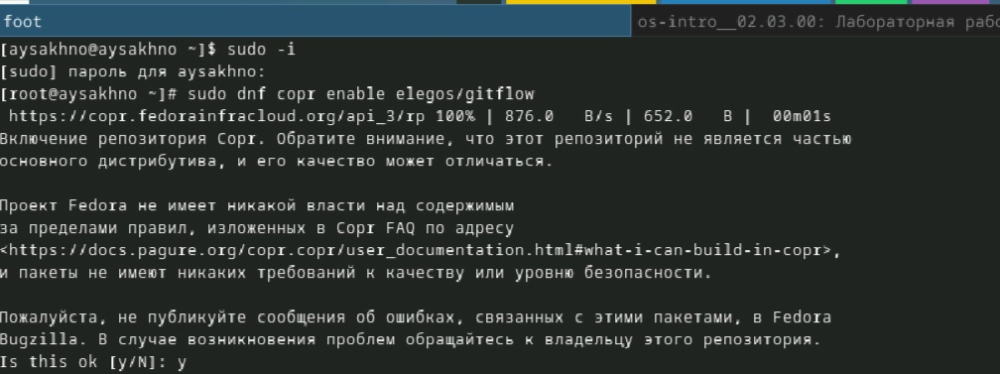

:::
::::::::::::::
# Установка программного обеспечения 

:::::::::::::: {.columns align=center}
::: {.column width="60%"}

:::
::: {.column width="40%"}

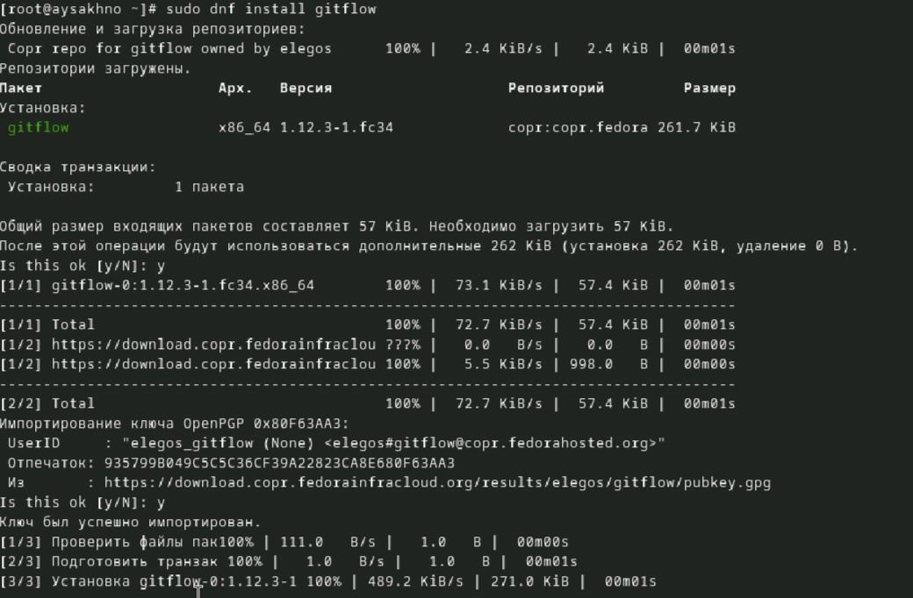

:::
::::::::::::::

##Установка Node.js

:::::::::::::: {.columns align=center}
::: {.column width="60%"}

:::
::: {.column width="40%"}

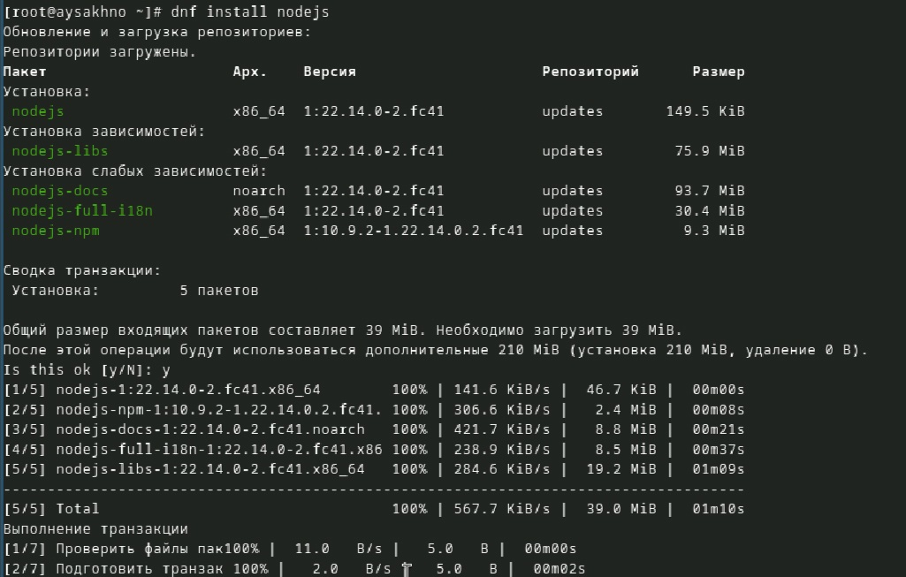

:::
::::::::::::::

#Установка Node.js  

:::::::::::::: {.columns align=center}
::: {.column width="60%"}

::: 
::: {.column width="40%"}

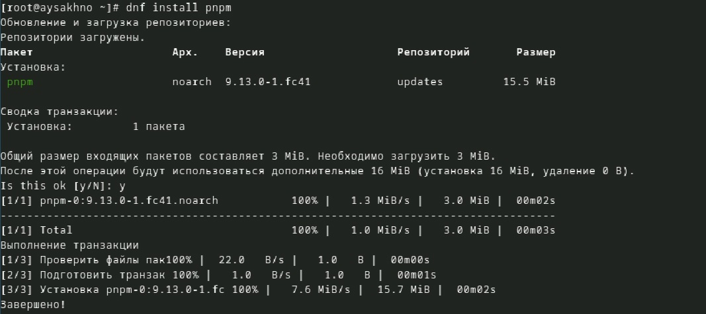

:::
::::::::::::::

## Настройка Node.js**

Для работы с Node.js добавим каталог с исполняемыми файлами, устанавливаемыми yarn, в переменную PATH.

:::::::::::::: {.columns align=center}
::: {.column width="60%"}

:::
::: {.column width="40%"}

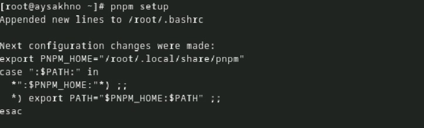

:::
::::::::::::::

#Перелогиньтесь, или выполните

:::::::::::::: {.columns align=center}
::: {.column width="60%"}

:::
::: {.column width="40%"}

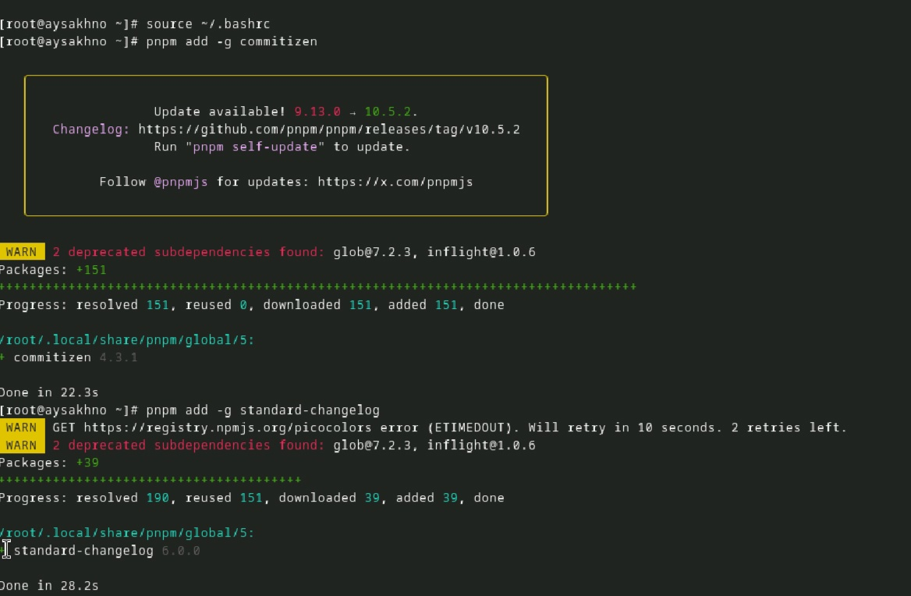

:::
::::::::::::::

#Общепринятые коммиты

     comitizen
Данная программа используется для помощи в форматировании коммитов.

       	pnpm add -g commitizen

При этом устанавливается скрипт git-cz, который мы и будем использовать для коммитов.

    standard-changelog

 Данная программа используется для помощи в создании логов.

      pnpm add -g standard-changelog

# Практический сценарий использования git

**Создание репозитория git**

Подключение репозитория к github

Создайте репозиторий на GitHub. Для примера назовём его git-extended.

Делаем первый коммит и выкладываем на github:

:::::::::::::: {.columns align=center}
::: {.column width="60%"}

:::
::: {.column width="40%"}

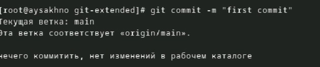

:::
::::::::::::::

# Практический сценарий использования git

:::::::::::::: {.columns align=center}
::: {.column width="60%"}

:::
::: {.column width="40%"}

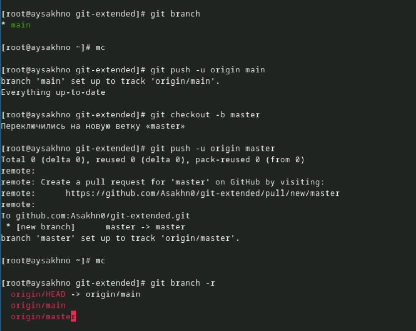

:::
::::::::::::::

**Сконфигурим формат коммитов. Для этого добавим в файл package.json команду для формирования коммитов:**

"config": {
       	"commitizen": {
            "path": "cz-conventional-changelog"
       	}
}

#Добавим новые файлы

:::::::::::::: {.columns align=center}
::: {.column width="60%"}

:::
::: {.column width="40%"}

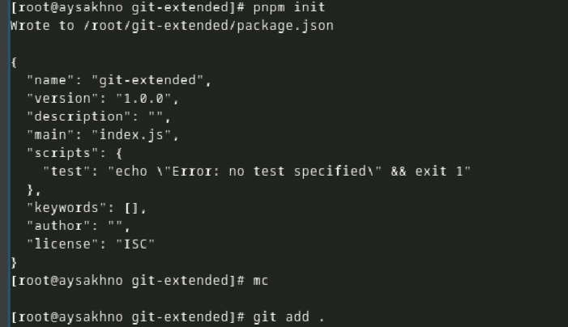

:::
::::::::::::::

**Выполним коммит**
:::::::::::::: {.columns align=center}
::: {.column width="60%"}

:::
::: {.column width="40%"}

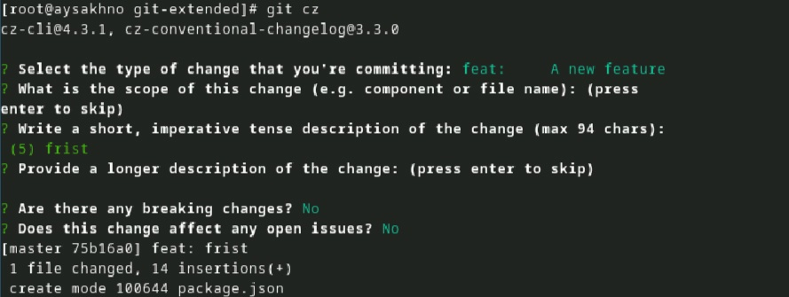

:::
::::::::::::::

**Отправим на github:**

:::::::::::::: {.columns align=center}
::: {.column width="60%"}

:::
::: {.column width="40%"}

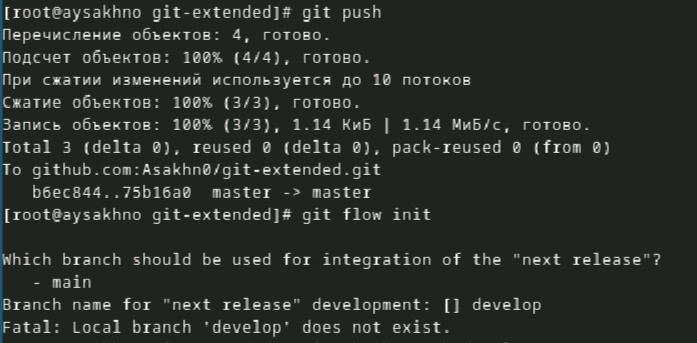

:::
::::::::::::::

##  Конфигурация git-flow

:::::::::::::: {.columns align=center}
::: {.column width="60%"}

:::
::: {.column width="40%"}

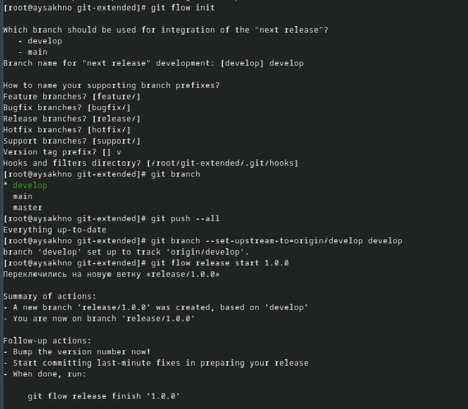

:::
::::::::::::::

##  Конфигурация git-flow

:::::::::::::: {.columns align=center}
::: {.column width="60%"}

:::
::: {.column width="40%"}

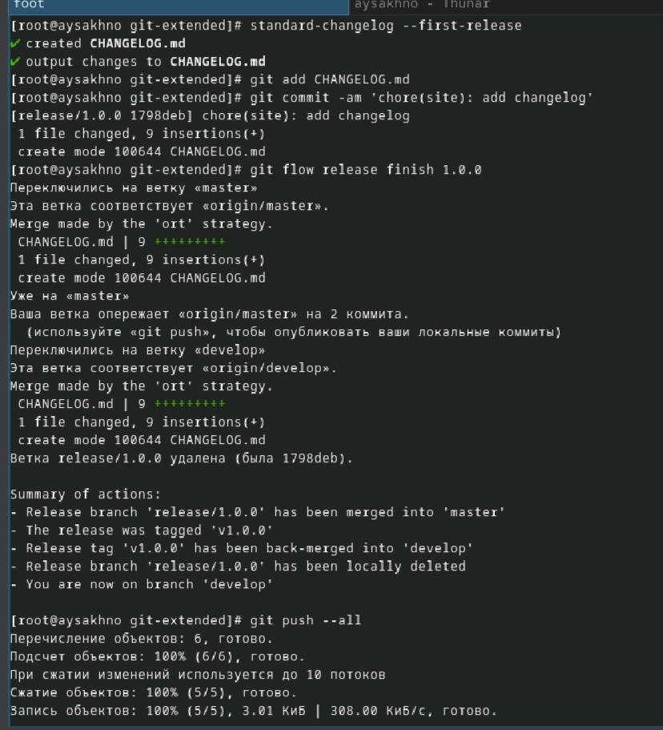

:::
::::::::::::::

#Работа с репозиторием git

** Разработка новой функциональности**

Создадим ветку для новой функциональности:

:::::::::::::: {.columns align=center}
::: {.column width="60%"}

:::
::: {.column width="40%"}

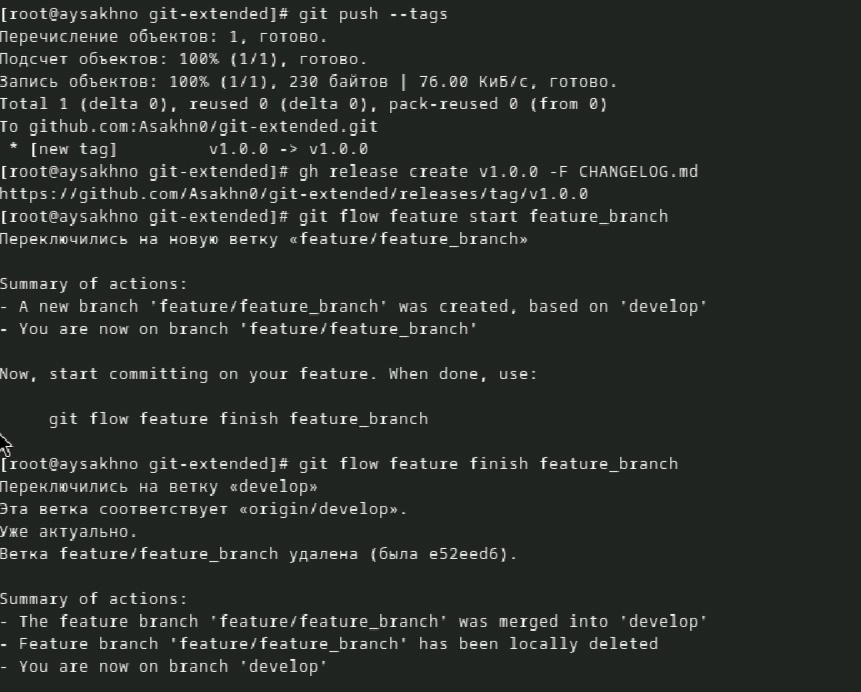

:::
::::::::::::::

#Создание релиза git-flow

**Создадим релиз с версией 1.2.3:**

:::::::::::::: {.columns align=center}
::: {.column width="60%"}

:::
::: {.column width="40%"}

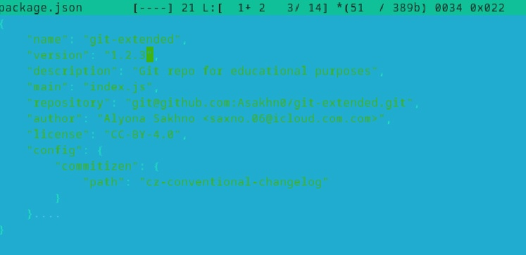

:::
::::::::::::::

# Создадим журнал изменений

:::::::::::::: {.columns align=center}
::: {.column width="60%"}

:::
::: {.column width="40%"}

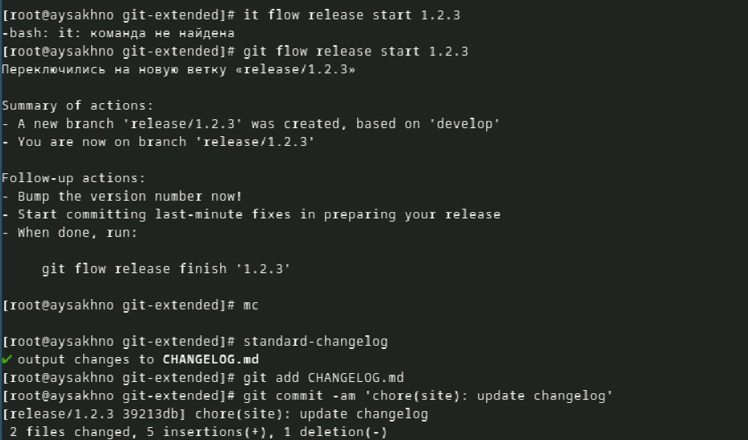

:::
::::::::::::::

# Добавим журнал изменений в индекс

:::::::::::::: {.columns align=center}
::: {.column width="60%"}
   
   * Зальём релизную ветку в основную ветку
   * Отправим данные на github
:::
::: {.column width="40%"}

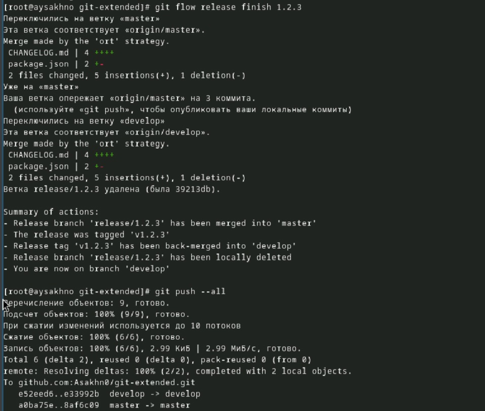

:::
::::::::::::::

# Создадим релиз на github с комментарием из журнала изменений:

:::::::::::::: {.columns align=center}
::: {.column width="60%"}

:::
::: {.column width="40%"}

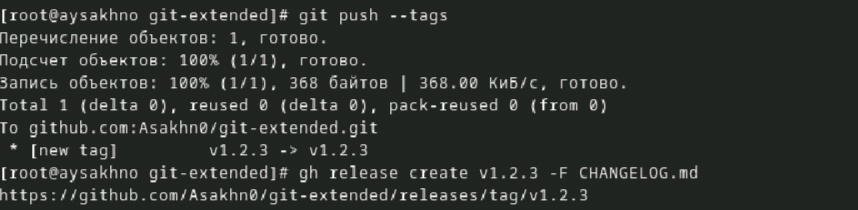

:::
::::::::::::::

## Вывод

- Я получила  навыков правильной работы с репозиториями git.

## Список литературы
 
::: {#refs} https://esystem.rudn.ru/mod/page/view.php?id=1224375
:::

::: incremental

:::

::: incremental
:::

::: incremental

:::

::: incremental

:::

