---
## Front matter
title: "Отчёта по лабораторной работе № 4"
subtitle: "Операционные системы"
author: "Сахно Алёна Юрьевна"

## Generic otions
lang: ru-RU
toc-title: "Содержание"

## Bibliography
bibliography: bib/cite.bib
csl: pandoc/csl/gost-r-7-0-5-2008-numeric.csl

## Pdf output format
toc: true # Table of contents
toc-depth: 2
lof: true # List of figures
lot: true # List of tables
fontsize: 12pt
linestretch: 1.5
papersize: a4
documentclass: scrreprt
## I18n polyglossia
polyglossia-lang:
  name: russian
  options:
	- spelling=modern
	- babelshorthands=true
polyglossia-otherlangs:
  name: english
## I18n babel
babel-lang: russian
babel-otherlangs: english
## Fonts
mainfont: IBM Plex Serif
romanfont: IBM Plex Serif
sansfont: IBM Plex Sans
monofont: IBM Plex Mono
mathfont: STIX Two Math
mainfontoptions: Ligatures=Common,Ligatures=TeX,Scale=0.94
romanfontoptions: Ligatures=Common,Ligatures=TeX,Scale=0.94
sansfontoptions: Ligatures=Common,Ligatures=TeX,Scale=MatchLowercase,Scale=0.94
monofontoptions: Scale=MatchLowercase,Scale=0.94,FakeStretch=0.9
mathfontoptions:
## Biblatex
biblatex: true
biblio-style: "gost-numeric"
biblatexoptions:
  - parentracker=true
  - backend=biber
  - hyperref=auto
  - language=auto
  - autolang=other*
  - citestyle=gost-numeric
## Pandoc-crossref LaTeX customization
figureTitle: "Рис."
tableTitle: "Таблица"
listingTitle: "Листинг"
lofTitle: "Список иллюстраций"
lotTitle: "Список таблиц"
lolTitle: "Листинги"
## Misc options
indent: true
header-includes:
  - \usepackage{indentfirst}
  - \usepackage{float} # keep figures where there are in the text
  - \floatplacement{figure}{H} # keep figures where there are in the text
---

# Цель работы
Получение навыков правильной работы с репозиториями git.

# Задание

- Выполнить работу для тестового репозитория.
- Преобразовать рабочий репозиторий в репозиторий с git-flow и conventional commits.

# Теоретическое введение

**Рабочий процесс Gitflow**

- Рабочий процесс Gitflow Workflow. Будем описывать его с использованием пакета git-flow.

**Процесс работы с Gitflow**
Основные ветки (master) и ветки разработки (develop)

Для фиксации истории проекта в рамках этого процесса вместо одной ветки master используются две ветки. В ветке master хранится официальная история релиза, а ветка develop предназначена для объединения всех функций. Кроме того, для удобства рекомендуется присваивать всем коммитам в ветке master номер версии.

При использовании библиотеки расширений git-flow нужно инициализировать структуру в существующем репозитории:

    git flow init

Для github параметр Version tag prefix следует установить в v.

После этого проверьте, на какой ветке Вы находитесь:

    git branch

**Функциональные ветки (feature)**

Под каждую новую функцию должна быть отведена собственная ветка, которую можно отправлять в центральный репозиторий для создания резервной копии или совместной работы команды. Ветки feature создаются не на основе master, а на основе develop. Когда работа над функцией завершается, соответствующая ветка сливается обратно с веткой develop. Функции не следует отправлять напрямую в ветку master.
Как правило, ветки feature создаются на основе последней ветки develop.

**Создание функциональной ветки**

Создадим новую функциональную ветку:

    git flow feature start feature_branch

Далее работаем как обычно.

Окончание работы с функциональной веткой

По завершении работы над функцией следует объединить ветку feature_branch с develop:

    git flow feature finish feature_branch

**Ветки выпуска (release)**

Когда в ветке develop оказывается достаточно функций для выпуска, из ветки develop создаётся ветка release. Создание этой ветки запускает следующий цикл выпуска, и с этого момента новые функции добавить больше нельзя — допускается лишь отладка, создание документации и решение других задач. Когда подготовка релиза завершается, ветка release сливается с master и ей присваивается номер версии. После нужно выполнить слияние с веткой develop, в которой с момента создания ветки релиза могли возникнуть изменения.
Благодаря тому, что для подготовки выпусков используется специальная ветка, одна команда может дорабатывать текущий выпуск, в то время как другая команда продолжает работу над функциями для следующего.

Создать новую ветку release можно с помощью следующей команды:

    git flow release start 1.0.0
   
Для завершения работы на ветке release используются следующие команды:

    git flow release finish 1.0.0

**Ветки исправления (hotfix)**

Ветки поддержки или ветки hotfix используются для быстрого внесения исправлений в рабочие релизы. Они создаются от ветки master. Это единственная ветка, которая должна быть создана непосредственно от master. Как только исправление завершено, ветку следует объединить с master и develop. Ветка master должна быть помечена обновлённым номером версии.
Наличие специальной ветки для исправления ошибок позволяет команде решать проблемы, не прерывая остальную часть рабочего процесса и не ожидая следующего цикла релиза.

Ветку hotfix можно создать с помощью следующих команд:

    git flow hotfix start hotfix_branch

По завершении работы ветка hotfix объединяется с master и develop:

    git flow hotfix finish hotfix_branch

# Выполнение лабораторной работы
## Установка программного обеспечения
**Установка git-flow**

    Linux

        Fedora

            Установка из коллекции репозиториев Copr

(рис.1 [-@fig:001]).
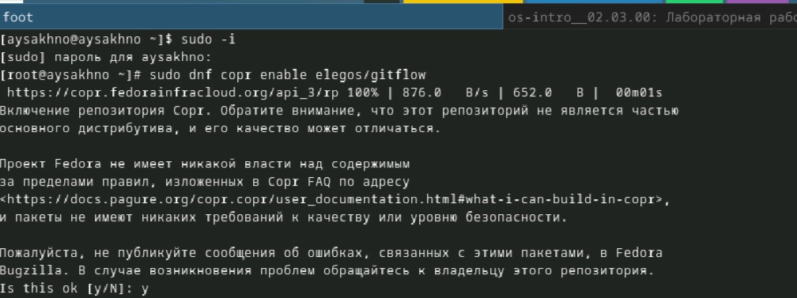{#fig:001  width=70%}

(рис.2 [-@fig:002]).
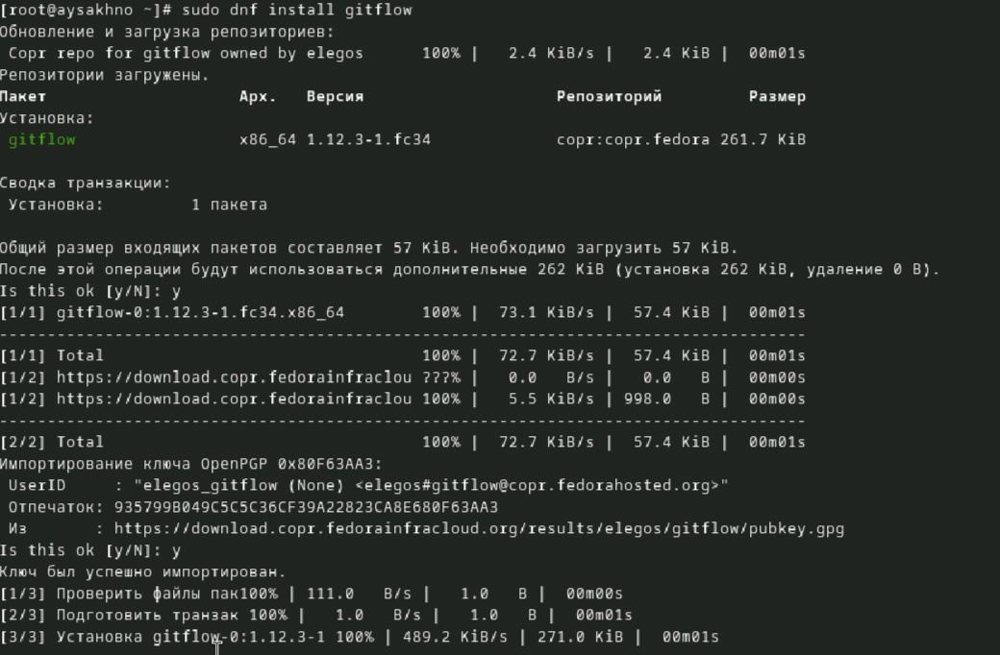{#fig:002  width=70%}

**Установка Node.js**

На Node.js базируется программное обеспечение для семантического версионирования и общепринятых коммитов.

    Fedora

(рис.3 [-@fig:003]).
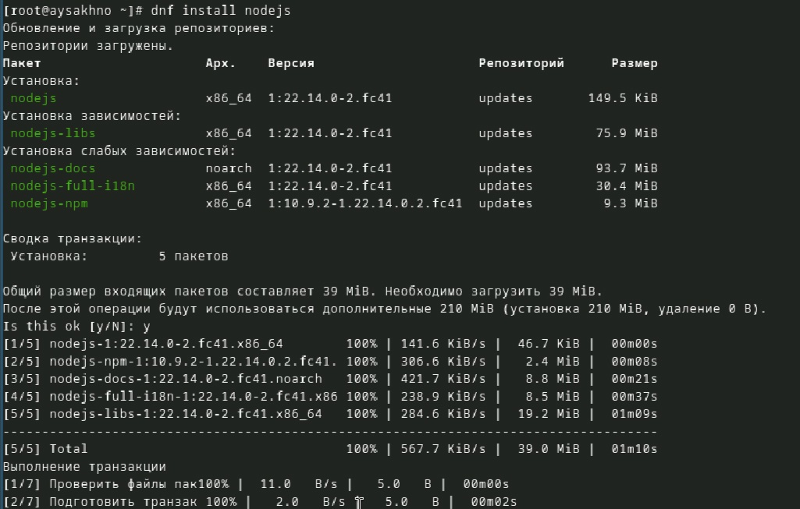{#fig:003  width=70%}

(рис.4 [-@fig:004]).
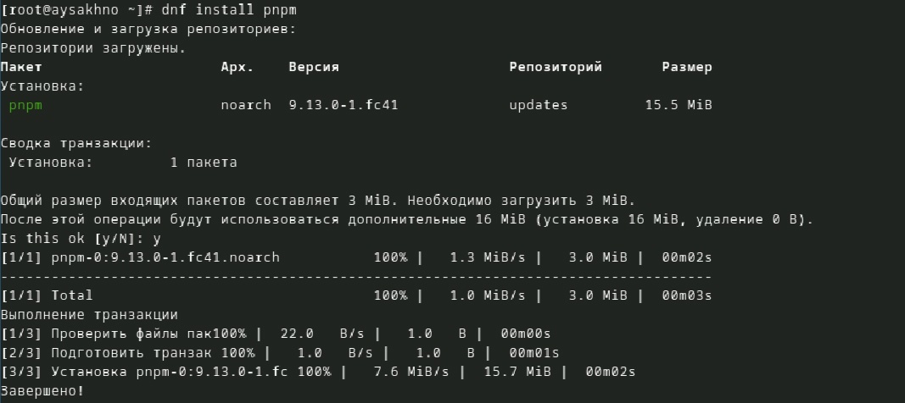{#fig:004  width=70%}

**Настройка Node.js**

Для работы с Node.js добавим каталог с исполняемыми файлами, устанавливаемыми yarn, в переменную PATH.

    Запустите:

(рис.5 [-@fig:005]).
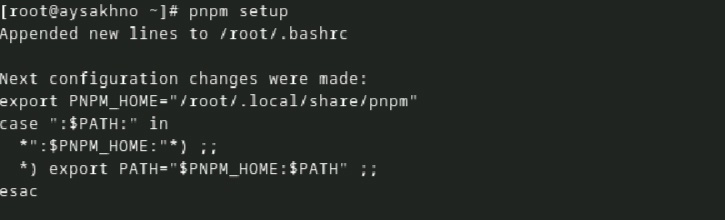{#fig:005  width=70%}

    Перелогиньтесь, или выполните:

(рис.6 [-@fig:006]).
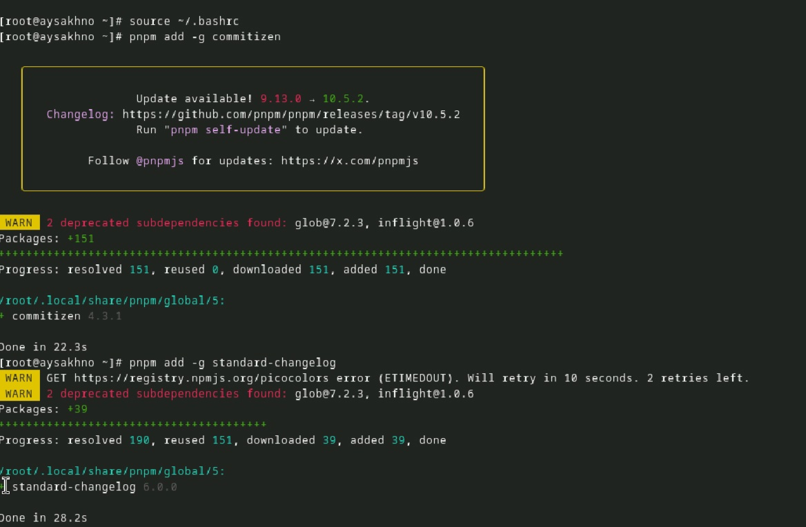{#fig:006  width=70%}

  
**Общепринятые коммиты**

     comitizen
Данная программа используется для помощи в форматировании коммитов.

        pnpm add -g commitizen

При этом устанавливается скрипт git-cz, который мы и будем использовать для коммитов.

    standard-changelog

 Данная программа используется для помощи в создании логов.

      pnpm add -g standard-changelog

# Практический сценарий использования git

**Создание репозитория git**

Подключение репозитория к github

Создайте репозиторий на GitHub. Для примера назовём его git-extended.

Делаем первый коммит и выкладываем на github:

(рис.7 [-@fig:007]).
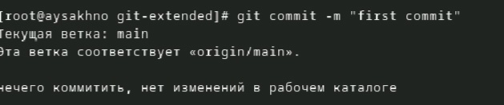{#fig:007  width=70%}

(рис.8 [-@fig:008]).
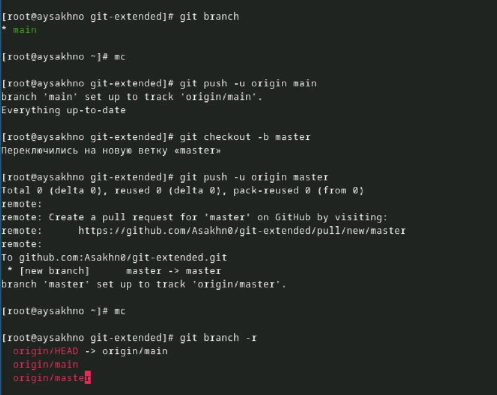{#fig:008  width=70%}

**Конфигурация общепринятых коммитов**

    Конфигурация для пакетов Node.js

**Сконфигурим формат коммитов. Для этого добавим в файл package.json команду для формирования коммитов:**

"config": {
        "commitizen": {
            "path": "cz-conventional-changelog"
        }
}

Таким образом, файл package.json приобретает вид:

{
    "name": "git-extended",
    "version": "1.0.0",
    "description": "Git repo for educational purposes",
    "main": "index.js",
    "repository": "git@github.com:username/git-extended.git",
    "author": "Name Surname <username@gmail.com>",
    "license": "CC-BY-4.0",
    "config": {
        "commitizen": {
            "path": "cz-conventional-changelog"
        }
    }    
}

**Добавим новые файлы:**

(рис.9 [-@fig:009]).
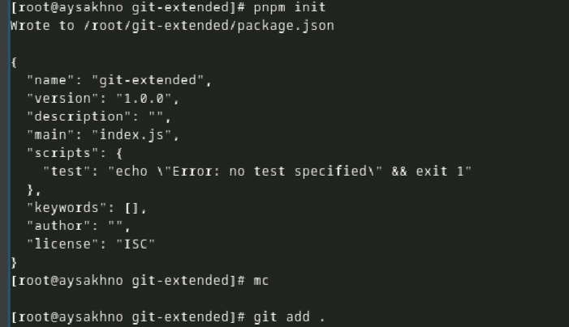{#fig:009  width=70%}

**Выполним коммит:**

(рис.10 [-@fig:010]).
{#fig:010  width=70%}

**Отправим на github:**

(рис.11 [-@fig:011]).
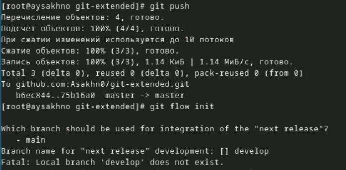{#fig:011  width=70%}

# Конфигурация git-flow

 Инициализируем git-flow

    git flow init

    
Префикс для ярлыков установим в v.

   
 Проверьте, что Вы на ветке develop:

    git branch

   
 Загрузите весь репозиторий в хранилище:

    git push --all

   
 Установите внешнюю ветку как вышестоящую для этой ветки:

    git branch --set-upstream-to=origin/develop develop

   
 Создадим релиз с версией 1.0.0

    git flow release start 1.0.0

(рис.12 [-@fig:012]).
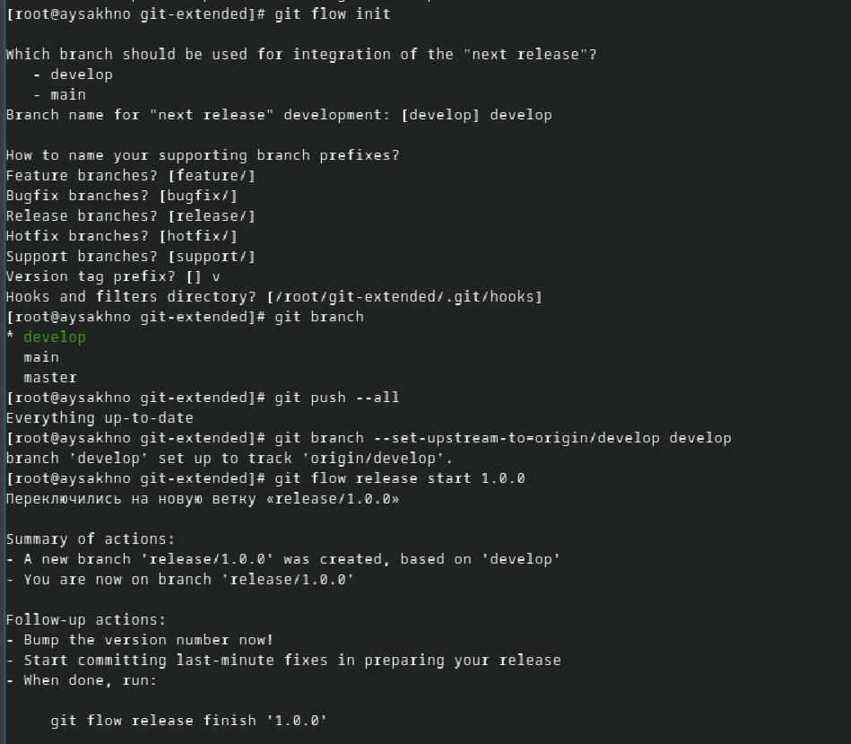{#fig:012  width=70%}

   
 Создадим журнал изменений

    standard-changelog --first-release

   
 Добавим журнал изменений в индекс
   
    git add CHANGELOG.md
    git commit -am 'chore(site): add changelog'

Зальём релизную ветку в основную ветку

    git flow release finish 1.0.0

Отправим данные на github

     git push --all
     git push --tags

(рис.13 [-@fig:013]).
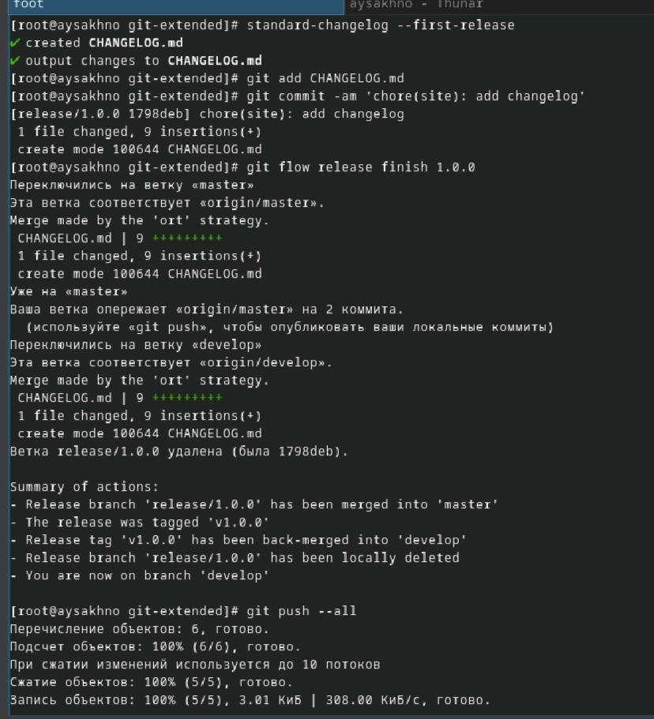{#fig:013  width=70%}

Создадим релиз на github. Для этого будем использовать утилиты работы с github:

    gh release create v1.0.0 -F CHANGELOG.md

#Работа с репозиторием git

** Разработка новой функциональности**

Создадим ветку для новой функциональности:

        git flow feature start feature_branch

(рис.14 [-@fig:014]).
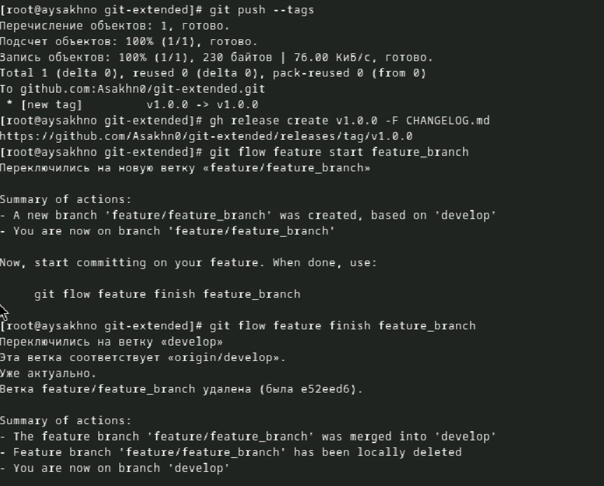{#fig:014  width=70%}

**Создание релиза git-flow**

Создадим релиз с версией 1.2.3:

    git flow release start 1.2.3

Обновите номер версии в файле package.json. Установите её в 1.2.3.

(рис.15 [-@fig:018]).
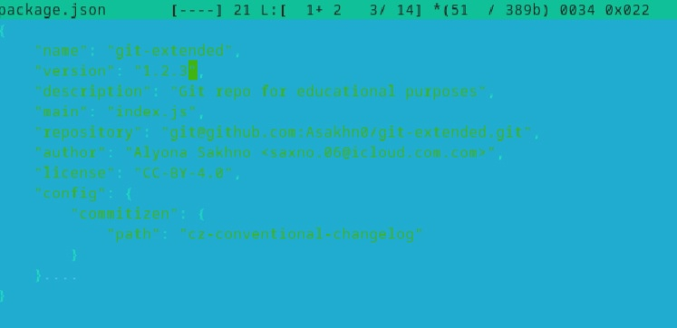{#fig:018  width=70%}

Создадим журнал изменений

    standard-changelog

(рис.16 [-@fig:015]).
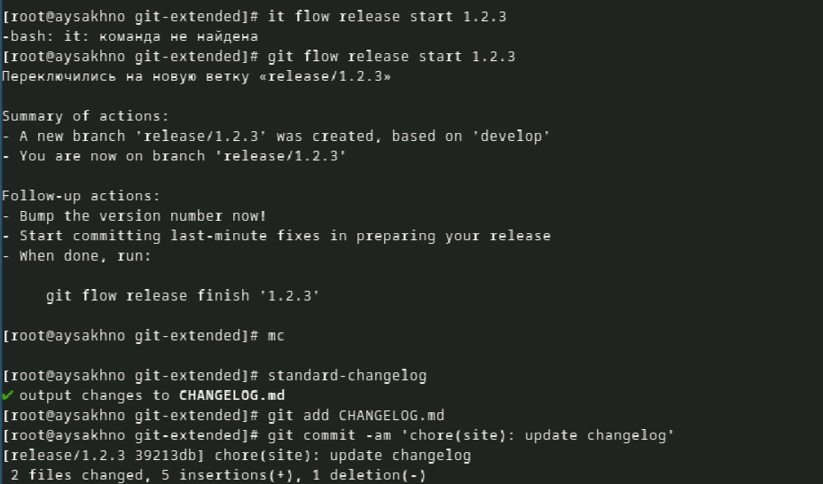{#fig:015  width=70%}

Добавим журнал изменений в индекс

    git add CHANGELOG.md
    git commit -am 'chore(site): update changelog'

Зальём релизную ветку в основную ветку

    git flow release finish 1.2.3

Отправим данные на github

    git push --all
    git push --tags

(рис.17	[-@fig:016]).
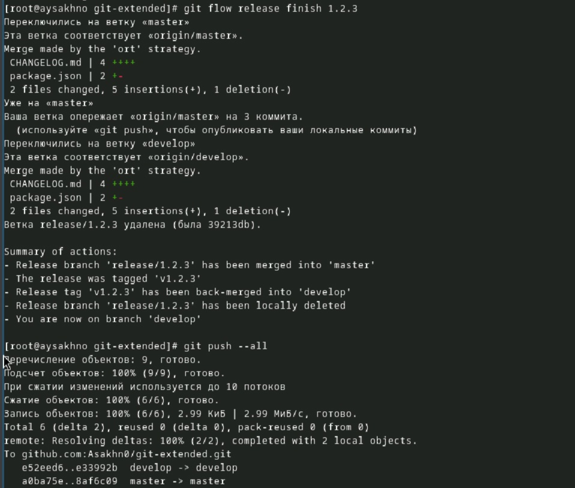{#fig:016  width=70%}

Создадим релиз на github с комментарием из журнала изменений:

    gh release create v1.2.3 -F CHANGELOG.md

(рис.18 [-@fig:017]).
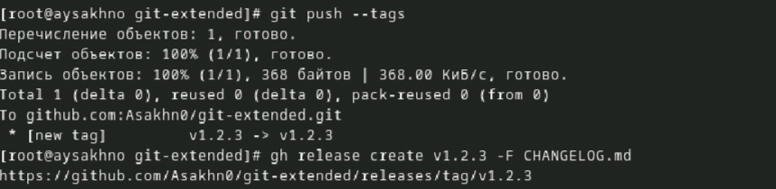{#fig:017  width=70%}

# Выводы
 Я получила  навыков правильной работы с репозиториями git.

# Список литературы{.unnumbered}

::: {#refs} https://esystem.rudn.ru/mod/page/view.php?id=1224375
:::
