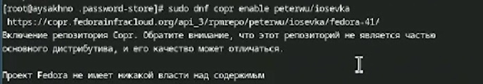

---
## Front matter
lang: ru-RU
title: Отчёт по лабораторной работе № 5
subtitle: Операционные системы
author:
  - Сахно Алёна Юрьевна 
  -  НКАбд-04-24 
institute:
  - Российский университет дружбы народов, Москва, Россия
  - Объединённый институт ядерных исследований, Дубна, Россия
date: 13 марта 2025

## i18n babel
babel-lang: russian
babel-otherlangs: english

## Formatting pdf
toc: false
toc-title: Содержание
slide_level: 2
aspectratio: 169
section-titles: true
theme: metropolis
header-includes:
 - \metroset{progressbar=frametitle,sectionpage=progressbar,numbering=fraction}
---

# Информация

## Преподаватель 

:::::::::::::: {.columns align=center}
::: {.column width="70%"}

  * Кулябов Дмитрий Сергеевич
  * д.ф.-м.н., профессор
  * профессор кафедры прикладной информатики и теории вероятностей
  * Российский университет дружбы народов
  * [kulyabov-ds@rudn.ru](mailto:kulyabov-ds@rudn.ru)
  * <https://yamadharma.github.io/ru/>

:::
::: {.column width="30%"}

:::
::::::::::::::

# Вводная часть

## Актуальность

- Научиться работать с Pass
## Объект и предмет исследования
- ОбЪектом исследования является структура базы паролей 
- Предметом исследования является  работа с pass 
## Цели и задачи
- Изучиь основные свойства структура базы паролей и уметь работать с pass.
-  Научиться работать pass 

## Теоретическая часть
Структура базы паролей

- Структура базы может быть произвольной, если Вы собираетесь использовать её напрямую, без промежуточного программного обеспечения. Тогда семантику структуры базы данны>
- Если же необходимо использовать дополнительное программное обеспечение, необходимо семантику заложить в структуру базы паролей.

Семантическая структура базы паролей

- Рассмотрим пользователя user в домене example.com, порт 22.

- Отсутствие имени пользователя или порта в имени файла означает, что любое имя пользователя и порт будут совпадать:

    example.com.pgp

- Соответствующее имя пользователя может быть именем файла внутри каталога, имя которого совпадает с хостом. Это полезно, если в базе есть пароли для нескольких пользова>

    example.com/user.pgp

- Имя пользователя также может быть записано в виде префикса, отделенного от хоста знаком @:

    user@example.com.pgp

- Соответствующий порт может быть указан после хоста, отделённый двоеточием (:):

    example.com:22.pgp
    example.com:22/user.pgp
    user@example.com:22.pgp
- Эти все записи могут быть расположены в произвольных каталогах, задающих Вашу собственную иерархию.

Способы создания файла шаблона

- При первом добавлении файла передайте аргумент --template:

    chezmoi add --template ~/.zshrc

- Если файл уже контролируется chezmoi, но не является шаблоном, можно сделать его шаблоном:

    chezmoi chattr +template ~/.zshrc

- Можно создать шаблон вручную в исходном каталоге, присвоив ему расширение .tmpl:

    chezmoi cd
    $EDITOR dot_zshrc.tmpl

- Шаблоны в каталоге .chezmoitemplates должны создаваться вручную:

    chezmoi cd
    mkdir -p .chezmoitemplates
    cd .chezmoitemplates
    $EDITOR mytemplate

Редактирование файла шаблона

- Используйте chezmoi edit:

   chezmoi edit ~/.zshrc

- Чтобы сделанные вами изменения сразу же применялись после выхода из редактора, используйте опцию --apply:

    chezmoi edit --apply ~/.zshrc

## Выполнение лабораторной работы

Менеджер паролей pass

Установка

    Fedora

       	pass; dnf install gopass

 
:::::::::::::: {.columns align=center}
::: {.column width="70%"}
  *  Fedora
  *  pass; dnf install gopass
:::
::: {.column width="30%"}

:::
::::::::::::::

# Настройка

    Ключи GPG

       	Просмотр списка ключей:

       	gpg --list-secret-keys

       	Если ключа нет, нужно создать новый:
	gpg --full-generate-key

:::::::::::::: {.columns align=center}
::: {.column width="70%"} 
:::
::: {.column width="30%"}

:::
::::::::::::::

# Инициализация хранилища

:::::::::::::: {.columns align=center}
::: {.column width="70%"}
  *  Инциализируем хранилище :
  *  pass init < gpg-id or email>
:::
::: {.column width="30%"}

:::
::::::::::::::

# Синхронизация с git

-  Создадим структуру git:

       	pass git init

- Также можно задать адрес репозитория на хостинге (репозиторий необходимо предварительно создать):

       	pass git remote add origin git@github.com:<git_username>/<git_repo>.git

#  Синхронизация с git  

:::::::::::::: {.columns align=center}
::: {.column width="70%"}

:::
::: {.column width="30%"}

:::
::::::::::::::

# Для синхронизации выполняется следующая команда:

       	pass git pull
       	pass git push

Прямые изменения
- Следует заметить, что отслеживаются только изменения, сделанные через сам gopass (или pass).
- Если изменения сделаны непосредственно на файловой системе, необходимо вручную закоммитить и выложить изменения:
  cd ~/.password-store/
            git add .
            git commit -am 'edit manually'
            git push

#  Прямые изменения 

:::::::::::::: {.columns align=center}
::: {.column width="70%"}
:::
::: {.column width="30%"}

:::
::::::::::::::

- Проверить статус синхронизации модно командой

            pass git status

Настройка интерфейса с броузером

- Для взаимодействия с броузером используется интерфейс native messaging.
- Поэтому кроме плагина к броузеру устанавливается программа, обеспечивающая интерфейс native messaging.

    Плагин browserpass
            Fedora

            dnf copr enable maximbaz/browserpass
            dnf install browserpass

# Настройка интерфейса с броузером

:::::::::::::: {.columns align=center}
::: {.column width="70%"}
  
:::
::: {.column width="30%"}

:::
::::::::::::::

## Сохранение пароля

- Добавить новый пароль

       	Выполните:

       	pass insert [OPTIONAL DIR]/[FILENAME]

            OPTIONAL DIR: необязательное имя каталога, определяющее файловую структуру для вашего хранилища паролей;
            FILENAME: имя файла, который будет использоваться для хранения пароля.

       	Отобразите пароль для указанного имени файла:

       	pass [OPTIONAL DIR]/[FILENAME]

       	Замените существующий пароль:

       	pass generate --in-place FILENAME

# Сохранение пароля 

:::::::::::::: {.columns align=center}
::: {.column width="70%"}
  
:::
::: {.column width="30%"}

:::
::::::::::::::

# Управление файлами конфигурации

Дополнительное программное обеспечение

    Установите дополнительное программное обеспечение:

    sudo dnf -y install \
             dunst \
             fontawesome-fonts \
             powerline-fonts \
             light \
             fuzzel \
             swaylock \
             kitty \
             waybar swaybg \
             wl-clipboard \
             mpv \
             grim \
             slurp

# Управление файлами конфигурации

:::::::::::::: {.columns align=center}
::: {.column width="70%"}
  
:::
::: {.column width="30%"}

:::
:::::::::::::: 
  
#  Установите шрифты:

    sudo dnf copr enable peterwu/iosevka
    sudo dnf search iosevka
    sudo dnf install iosevka-fonts iosevka-aile-fonts iosevka-curly-fonts iosevka-slab-fonts iosevka-etoile-fonts iosevka-term-fonts

# Установите шифр

:::::::::::::: {.columns align=center}
::: {.column width="70%"}
  
:::
::: {.column width="30%"}

:::
::::::::::::::

Установка

    Установка бинарного файла. Скрипт определяет архитектуру процессора и операционную систему и скачивает необходимый файл:

       	с помощью wget:

       	sh -c "$(wget -qO- chezmoi.io/get)"

# Установка 

:::::::::::::: {.columns align=center}
::: {.column width="70%"}
  
:::
::: {.column width="30%"}

:::
::::::::::::::

# Создание собственного репозитория с помощью утилит

    Будем использовать утилиты командной строки для работы с github.

    Создадим свой репозиторий для конфигурационных файлов на основе шаблона:

    gh repo create dotfiles --template="yamadharma/dotfiles-template" --private

# Создание собственного репозитория с помощью утилит

:::::::::::::: {.columns align=center}
::: {.column width="70%"}
  
:::
::: {.column width="30%"}

:::
::::::::::::::

# Подключение репозитория к своей системе

    Инициализируйте chezmoi с вашим репозиторием dotfiles:

    chezmoi init git@github.com:<username>/dotfiles.git

    Проверьте, какие изменения внесёт chezmoi в домашний каталог, запустив:

    chezmoi diff

    Если вас устраивают изменения, внесённые chezmoi, запустите:

    chezmoi apply -v

# Подключение репозитория к своей системе 

:::::::::::::: {.columns align=center}
::: {.column width="70%"}
  
:::
::: {.column width="30%"}

:::
::::::::::::::

## Использование chezmoi на нескольких машинах

    На второй машине инициализируйте chezmoi с вашим репозиторием dotfiles:

    chezmoi init https://github.com/<username>/dotfiles.git

    Или через ssh:

    chezmoi init git@github.com:<username>/dotfiles.git

    Проверьте, какие изменения внесёт chezmoi в домашний каталог, запустив:

    chezmoi diff

    Если вас устраивают изменения, внесённые chezmoi, запустите:

    chezmoi apply -v

    Если вас не устраивают изменения в файле, отредактируйте его с помощью:

    chezmoi edit file_name

    Также можно вызвать инструмент слияния, чтобы объединить изменения между текущим содержимым файла, файлом в вашей рабочей копии и измененным содержимым файла:

    chezmoi merge file_name

    При существующем каталоге chezmoi можно получить и применить последние изменения из вашего репозитория:

    chezmoi update -v

# На второй машине 

:::::::::::::: {.columns align=center}
::: {.column width="70%"}
  
:::
::: {.column width="30%"}

:::
::::::::::::::

# Настройка новой машины с помощью одной команды

    Можно установить свои dotfiles на новый компьютер с помощью одной команды:
	chezmoi update

       	Это запускается git pull --autostash --rebase в вашем исходном каталоге, а затем chezmoi apply.

-  Извлеките последние изменения из своего репозитория и посмотрите, что изменится, фактически не применяя изменения

       	Выполните:

       	chezmoi git pull -- --autostash --rebase && chezmoi diff

Это запускается git pull --autostash --rebase в вашем исходном каталоге, а chezmoi diff затем показывает разницу между целевым состоянием, вычисленным из вашего исходног>

- Если вы довольны изменениями, вы можете применить их:

       	chezmoi apply

# Ежедневные операциир 

:::::::::::::: {.columns align=center}
::: {.column width="70%"}
  
:::
::: {.column width="30%"}

:::
::::::::::::::

## Автоматически фиксируйте и отправляйте изменения в репозиторий
   Можно автоматически фиксировать и отправлять изменения в исходный каталог в репозиторий.
   Эта функция отключена по умолчанию.

- Чтобы включить её, добавьте в файл конфигурации ~/.config/chezmoi/chezmoi.toml следующее:
     	[git]
            autoCommit = true
            autoPush = true

- Всякий раз, когда в исходный каталог вносятся изменения, chezmoi фиксирует изменения с помощью автоматически сгенерированного сообщения фиксации и отправляет их в ваш >
- Будьте осторожны при использовании autoPush. Если ваш репозиторий dotfiles является общедоступным, и вы случайно добавили секрет в виде обычного текста, этот секрет бу>

# Изменение в репозиторий

:::::::::::::: {.columns align=center}
::: {.column width="70%"}
  
:::
::: {.column width="30%"}

:::
::::::::::::::

## Выводы

Я изучила основные свойства структура базы паролей и сумела по- работать с pass.

## Список литературы{.unnumbered}

https://esystem.rudn.ru/mod/page/view.php?id=1224377

::: incremental

:::

::: incremental

:::

::: incremental
:::

::: incremental

:::

