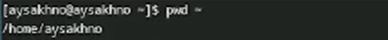
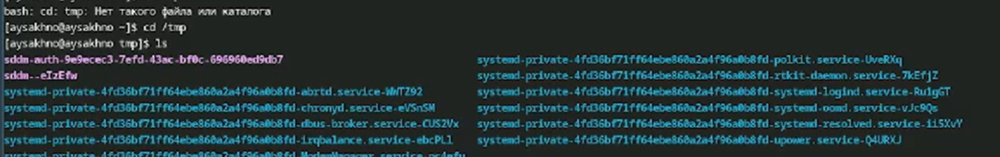
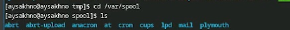
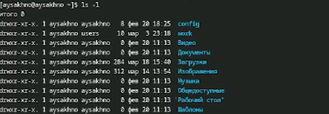
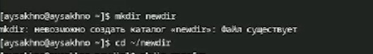
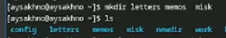
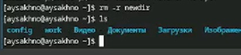
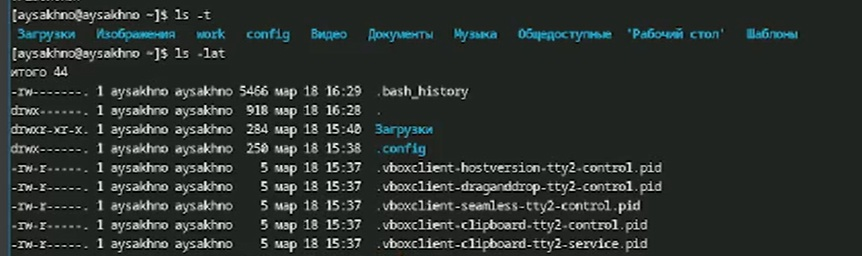
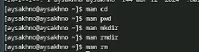
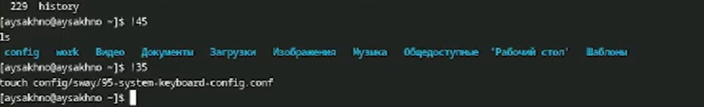

---
## Front matter
lang: ru-RU
title: Отчёт по лабораторной работе № 6
subtitle: Операцинные системы
author:
  - Сахно Алёна Юрьевна 
institute:
  - Российский университет дружбы народов, Москва, Россия
  - Объединённый институт ядерных исследований, Дубна, Россия
date: 18 марта 2025

## i18n babel
babel-lang: russian
babel-otherlangs: english

## Formatting pdf
toc: false
toc-title: Содержание
slide_level: 2
aspectratio: 169
section-titles: true
theme: metropolis
header-includes:
 - \metroset{progressbar=frametitle,sectionpage=progressbar,numbering=fraction}
---

# Информация

## Докладчик

:::::::::::::: {.columns align=center}
::: {.column width="70%"}

  * Кулябов Дмитрий Сергеевич
  * д.ф.-м.н., профессор
  * профессор кафедры прикладной информатики и теории вероятностей
  * Российский университет дружбы народов
  * [kulyabov-ds@rudn.ru](mailto:kulyabov-ds@rudn.ru)
  * <https://yamadharma.github.io/ru/>

:::
::: {.column width="30%"}

:::
::::::::::::::

## Актуальность
Данной темой является научиться работать 

## Объект и предмет исследования
Объектов исследования является приобретение навыков 
предмет исследоваания является система командной строки
## Цели 

Приобретение практических навыков взаимодействия пользователя с системой посредством командной строки.

## Теоретическая часть 
 Указания к работе
В операционной системе типа Linux взаимодействие пользователя с системой обычно
осуществляется с помощью командной строки посредством построчного ввода ко-
манд. При этом обычно используется командные интерпретаторы языка shell: /bin/sh;
/bin/csh; /bin/ksh.
Формат команды. Командой в операционной системе называется записанный по
специальным правилам текст (возможно с аргументами), представляющий собой ука-
зание на выполнение какой-либо функций (или действий) в операционной системе.
Обычно первым словом идёт имя команды, остальной текст — аргументы или опции,
конкретизирующие действие.
Общий формат команд можно представить следующим образом:
<имя_команды><разделитель><аргументы>
# Теоретическая часть
 **Команда man.** Команда man используется для просмотра (оперативная помощь) в диа-
логовом режиме руководства (manual) по основным командам операционной системы
типа Linux.
Формат команды:
man <команда>
# Теоретическая часть
**Команда cd.** Команда cd используется для перемещения по файловой системе опера-
ционной системы типа Linux.
Замечание 1. Файловая система ОС типа Linux — иерархическая система каталогов,
подкаталогов и файлов, которые обычно организованы и сгруппированы по функ-
циональному признаку. Самый верхний каталог в иерархии называется корневым
и обозначается символом /. Корневой каталог содержит системные файлы и другие
каталоги.
Формат команды:
cd [путь_к_каталогу]
# Теоретическая часть
**Команда pwd.** Для определения абсолютного пути к текущему каталогу используется
команда pwd (print working directory).

# Теоретическая часть
**Команда ls.** Команда ls используется для просмотра содержимого каталога.
Формат команды:
ls [-опции] [путь]
**Команда mkdir.** Команда mkdir используется для создания каталогов.
Формат команды:
mkdir имя_каталога1 [имя_каталога2...]
# Теоретическая часть
**Команда rm.** Команда rm используется для удаления файлов и/или каталогов.
Формат команды:
rm [-опции] [файл]
Если требуется, чтобы выдавался запрос подтверждения на удаление файла, то необхо-
димо использовать опцию i.
Чтобы удалить каталог, содержащий файлы, нужно использовать опцию r. Без указания
этой опции команда не будет выполняться.
**Команда history.** Для вывода на экран списка ранее выполненных команд исполь-
зуется команда history. Выводимые на экран команды в списке нумеруются. К любой
команде из выведенного на экран списка можно обратиться по её номеру в списке,
воспользовавшись конструкцией !<номер_команды>.

## Выполнение лабораторной работы 

:::::::::::::: {.columns align=center}
::: {.column width="70%"}

  *  Определите полное имя вашего домашнего каталога. Далее относительно этого ката-
лога будут выполняться последующие упражнения.

:::
::: {.column width="30%"}

:::
::::::::::::::

# Выполнение лабораторной работы 

:::::::::::::: {.columns align=center}
::: {.column width="70%"}

   * Перейдите в каталог /tmp.
   *  Выведите на экран содержимое каталога /tmp. Для этого используйте команду ls
с различными опциями. Поясните разницу в выводимой на экран информации.

:::
::: {.column width="30%"}

:::
::::::::::::::

# Выполнение лабораторной работы 
:::::::::::::: {.columns align=center}
::: {.column width="70%"}

  *   Определите, есть ли в каталоге /var/spool подкаталог с именем cron?

:::
::: {.column width="30%"}

:::
::::::::::::::
# Выполнение лабораторной работы 
:::::::::::::: {.columns align=center}
::: {.column width="70%"}

  *   Перейдите в Ваш домашний каталог и выведите на экран его содержимое. Опре-
делите, кто является владельцем файлов и подкаталогов?

:::
::: {.column width="30%"}

:::
::::::::::::::
# Выполнение лабораторной работы 
:::::::::::::: {.columns align=center}
::: {.column width="70%"}

  *   В домашнем каталоге создайте новый каталог с именем newdir.

:::
::: {.column width="30%"}

:::
::::::::::::::
# Выполнение лабораторной работы
:::::::::::::: {.columns align=center}
::: {.column width="70%"}

  *  В каталоге ~/newdir создайте новый каталог с именем morefun.

:::
::: {.column width="30%"}

:::
::::::::::::::

# Выполнение лабораторной работы

:::::::::::::: {.columns align=center}
::: {.column width="70%"}

  *    В домашнем каталоге создайте одной командой три новых каталога с именами letters, memos, misk. Затем удалите эти каталоги одной командой.

:::
::: {.column width="30%"}

:::
::::::::::::::

# Выполнение лабораторной работы

:::::::::::::: {.columns align=center}
::: {.column width="70%"}

  *   Попробуйте удалить ранее созданный каталог ~/newdir командой rm. Проверьте, был ли каталог удалён.

:::
::: {.column width="30%"}

:::
::::::::::::::

# Выполнение лабораторной работы

:::::::::::::: {.columns align=center}
::: {.column width="70%"}

  *  Удалите каталог ~/newdir/morefun из домашнего каталога. Проверьте, был ли каталог удалён.

:::
::: {.column width="30%"}

:::
::::::::::::::

# Выполнение лабораторной работы

:::::::::::::: {.columns align=center}
::: {.column width="70%"}

  *   С помощью команды man определите, какую опцию команды ls нужно использовать для просмотра содержимое не только указанного каталога, но и подкаталогов,
входящих в него.

:::
::: {.column width="30%"}

:::
::::::::::::::

# Выполнение лабораторной работы

:::::::::::::: {.columns align=center}
::: {.column width="70%"}

  *   Используйте команду man для просмотра описания следующих команд: cd, pwd, mkdir,rmdir, rm. Поясните основные опции этих команд.

:::
::: {.column width="30%"}

:::
::::::::::::::

# Выполнение лабораторной работы

:::::::::::::: {.columns align=center}
::: {.column width="70%"}

  *  Используя информацию, полученную при помощи команды history, выполните мо-
дификацию и исполнение нескольких команд из буфера команд.

:::
::: {.column width="30%"}

:::
:::::::::::::: 

## Выводы

Я приобрела  практических навыков взаимодействия пользователя с системой посредством командной строки.

##  Список литературы{.unnumbered}

::: file:///home/aysakhno/%D0%97%D0%B0%D0%B3%D1%80%D1%83%D0%B7%D0%BA%D0%B8/004-lab_shell.pdf
:::
::: incremental

:::

::: incremental
:::
::: incremental
:::
::: incremental

:::

