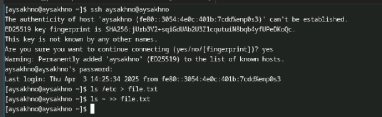
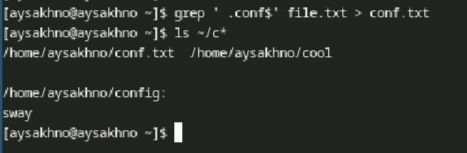
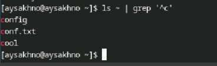

---
## Front matter
lang: ru-RU
title: Отчёт по лабораторной работе № 8
subtitle: Операционные системы
author:
  - Сахно А.Ю.
institute:
  - Российский университет дружбы народов, Москва, Россия
  - Объединённый институт ядерных исследований, Дубна, Россия
date: 11.04.25

## i18n babel
babel-lang: russian
babel-otherlangs: english

## Formatting pdf
toc: false
toc-title: Содержание
slide_level: 2
aspectratio: 169
section-titles: true
theme: metropolis
header-includes:
 - \metroset{progressbar=frametitle,sectionpage=progressbar,numbering=fraction}
---

# Информация

## Преподаватель

:::::::::::::: {.columns align=center}
::: {.column width="70%"}

  * Кулябов Дмитрий Сергеевич
  * д.ф.-м.н., профессор
  * профессор кафедры прикладной информатики и теории вероятностей
  * Российский университет дружбы народов
  * [kulyabov-ds@rudn.ru](mailto:kulyabov-ds@rudn.ru)
  * <https://yamadharma.github.io/ru/>

:::
::: {.column width="30%"}

:::
::::::::::::::

## Объект и предмет исследования

- Объектом исследования является ознакомление с инструментами поиска файлов 
- предметои исследования является приобретение практических навыков

## Цель

Ознакомление с инструментами поиска файлов и фильтрации текстовых данных.
Приобретение практических навыков: по управлению процессами (и заданиями), по
проверке использования диска и обслуживанию файловых систем

## Теоретическая часть

6.2. Указания к работе

6.2.1. Перенаправление ввода-вывода

В системе по умолчанию открыто три специальных потока:
– stdin — стандартный поток ввода (по умолчанию: клавиатура), файловый дескриптор
0;
– stdout — стандартный поток вывода (по умолчанию: консоль), файловый дескриптор
1;
– stderr — стандартный поток вывод сообщений об ошибках (по умолчанию: консоль),
файловый дескриптор 2.
Большинство используемых в консоли команд и программ записывают результаты
своей работы в стандартный поток вывода stdout. Например, команда ls выводит в стан-
дартный поток вывода (консоль) список файлов в текущей директории. Потоки вывода
и ввода можно перенаправлять на другие файлы или устройства. Проще всего это делает>
с помощью символов >, >>, <, <<. Рассмотрим пример.

6.2.2. Конвейер
Конвейер (pipe) служит для объединения простых команд или утилит в цепочки, в ко-
торых результат работы предыдущей команды передаётся последующей.

## Выполнение лабораторной работы 

:::::::::::::: {.columns align=center}
::: {.column width="70%"}

  * Осуществите вход в систему, используя соответствующее имя пользователя.
  * Запишите в файл file.txt названия файлов, содержащихся в каталоге /etc. 

:::
::: {.column width="30%"}

:::
::::::::::::::

## Выполнение лабораторной работы 

3. Выведите имена всех файлов из file.txt, имеющих расширение .conf, после чего
запишите их в новый текстовой файл conf.txt.
4. Определите, какие файлы в вашем домашнем каталоге имеют имена, начинавшиеся
с символа c? Предложите несколько вариантов, как это сделать.

:::::::::::::: {.columns align=center}
::: {.column width="70%"}

  * Выведите имена всех файлов из file.txt, имеющих расширение .conf

:::
::: {.column width="30%"}

:::
::::::::::::::

## Выполнение лабораторной работы 

:::::::::::::: {.columns align=center}
::: {.column width="70%"}

  * Определите, какие файлы в вашем домашнем каталоге имеют имена       

:::
::: {.column width="30%"}

:::
::::::::::::::

## Выполнение лабораторной работы 

:::::::::::::: {.columns align=center}
::: {.column width="70%"}

  * Выведите на экран (по странично) имена файлов из каталога /etc,
  * Запустите в фоновом режиме процесс, который будет записывать в файл      

:::
::: {.column width="30%"}

:::
::::::::::::::

## Выполнение лабораторной работы 

:::::::::::::: {.columns align=center}
::: {.column width="70%"}

  * Удалите файл ~/logfile.       

:::
::: {.column width="30%"}

:::
::::::::::::::

## Выполнение лабораторной работы 

:::::::::::::: {.columns align=center}
::: {.column width="70%"}

  * Запустите из консоли в фоновом режиме редактор gedit. 

:::
::: {.column width="30%"}

:::
::::::::::::::

## Выполнение лабораторной работы 

:::::::::::::: {.columns align=center}
::: {.column width="70%"}

  * Определите идентификатор процесса gedit, используя команду ps

:::
::: {.column width="30%"}

:::
::::::::::::::

## Выполнение лабораторной работы 

:::::::::::::: {.columns align=center}
::: {.column width="70%"}

  * Прочтите справку (man) команды kill

:::
::: {.column width="30%"}

:::
::::::::::::::

## Выполнение лабораторной работы 

:::::::::::::: {.columns align=center}
::: {.column width="70%"}

  * Выполните команды df и du                          

:::
::: {.column width="30%"}

:::
::::::::::::::

## Выполнение лабораторной работы 

:::::::::::::: {.columns align=center}
::: {.column width="70%"}

  * Выполните команды df и du                          

:::
::: {.column width="30%"}

:::
::::::::::::::

## Выполнение лабораторной работы 

:::::::::::::: {.columns align=center}
::: {.column width="70%"}

  * Воспользовавшись справкой команды find                          

:::
::: {.column width="30%"}

:::
::::::::::::::

## Выводы

Я ознакомилась с инструментами поиска файлов и фильтрации текстовых данных.
Приобретение практических навыков: по управлению процессами (и заданиями), по
проверке использования диска и обслуживанию файловых систем

::: incremental

:::

::: incremental

:::

::: incremental

:::

::: incremental

:::

