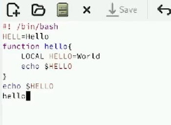
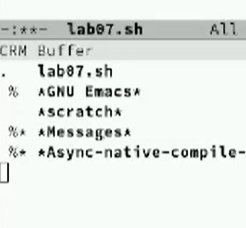

---
## Front matter
lang: ru-RU
title: Отчёт по лабораторной работе № 11
subtitle: Операционные системы
author:
  - Сахно  А. Ю.
institute:
  - Российский университет дружбы народов, Москва, Россия
  - Объединённый институт ядерных исследований, Дубна, Россия
date: 01 января 1970

## i18n babel
babel-lang: russian
babel-otherlangs: english

## Formatting pdf
toc: false
toc-title: Содержание
slide_level: 2
aspectratio: 169
section-titles: true
theme: metropolis
header-includes:
 - \metroset{progressbar=frametitle,sectionpage=progressbar,numbering=fraction}
---

# Информация

## Преподаватель

:::::::::::::: {.columns align=center}
::: {.column width="70%"}

  * Кулябов Дмитрий Сергеевич
  * д.ф.-м.н., профессор
  * профессор кафедры прикладной информатики и теории вероятностей
  * Российский университет дружбы народов
  * [kulyabov-ds@rudn.ru](mailto:kulyabov-ds@rudn.ru)
  * <https://yamadharma.github.io/ru/>

:::
::: {.column width="30%"}

:::
::::::::::::::

## Цель работы 

Познакомиться с операционной системой Linux. Получить практические навыки работы с редактором Emacs.

## Теоретическая часть 

Определение 1. Буфер — объект, представляющий какой-либо текст.
Буфер может содержать что угодно, например, результаты компиляции программы
или встроенные подсказки. Практически всё взаимодействие с пользователем, в том
числе интерактивное, происходит посредством буферов.
Определение 2. Фрейм соответствует окну в обычном понимании этого слова. Каждый
фрейм содержит область вывода и одно или несколько окон Emacs.
Определение 3. Окно — прямоугольная область фрейма, отображающая один из буфе-
ров.

## Выполнение л/р

:::::::::::::: {.columns align=center}
::: {.column width="70%"}

  * Открыть emacs.

:::
::: {.column width="30%"}

:::
::::::::::::::

## Выполнение л/р

:::::::::::::: {.columns align=center}
::: {.column width="70%"}

  * Создать файл lab07.sh с помощью комбинации Ctrl-x Ctrl-f (C-x C-f).
  * Наберите текст:           

:::
::: {.column width="30%"}

:::
::::::::::::::

## Выполнение л/р

. Сохранить файл с помощью комбинации Ctrl-x Ctrl-s (C-x C-s).
5. Проделать с текстом стандартные процедуры редактирования, каждое действие долж-
но осуществляться комбинацией клавиш.
5.1. Вырезать одной командой целую строку (С-k).
5.2. Вставить эту строку в конец файла (C-y).
5.3. Выделить область текста (C-space).
5.4. Скопировать область в буфер обмена (M-w).
5.5. Вставить область в конец файла.
5.6. Вновь выделить эту область и на этот раз вырезать её (C-w).
5.7. Отмените последнее действие (C-/)

## Выполнение л/р

6. Научитесь использовать команды по перемещению курсора.
6.1. Переместите курсор в начало строки (C-a).
6.2. Переместите курсор в конец строки (C-e).
6.3. Переместите курсор в начало буфера (M-<).
6.4. Переместите курсор в конец буфера (M->).
7. Управление буферами.
7.1. Вывести список активных буферов на экран (C-x C-b).

## Выполнение л/р

:::::::::::::: {.columns align=center}
::: {.column width="70%"}
           

:::
::: {.column width="30%"}

:::
::::::::::::::

## Вывод

Я познакомилась с операционной системой Linux. Получила практические навыки работы с редактором Emacs.

::: incremental

:::

:::

::: incremental
:::

::: incremental

:::

