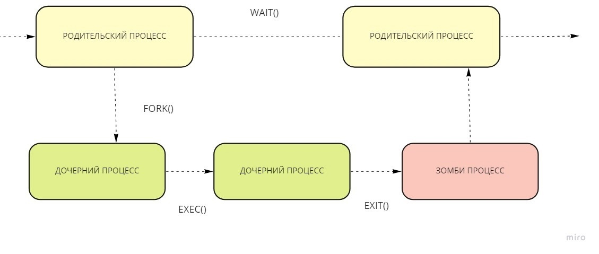

---
## Front matter
title: "Доклад"
subtitle: "Обзор подходов к созданию дочерних процессов и разделению ресурсов дочерним и родительским процессами в операционных системах."
author: "Сахно Алёна Юрьевна"

## Generic otions
lang: ru-RU
toc-title: "Содержание"

## Bibliography
bibliography: bib/cite.bib
csl: pandoc/csl/gost-r-7-0-5-2008-numeric.csl

## Pdf output format
toc: true # Table of contents
toc-depth: 2
lof: true # List of figures
lot: true # List of tables
fontsize: 12pt
linestretch: 1.5
papersize: a4
documentclass: scrreprt
## I18n polyglossia
polyglossia-lang:
  name: russian
  options:
	- spelling=modern
	- babelshorthands=true
polyglossia-otherlangs:
  name: english
## I18n babel
babel-lang: russian
babel-otherlangs: english
## Fonts
mainfont: IBM Plex Serif
romanfont: IBM Plex Serif
sansfont: IBM Plex Sans
monofont: IBM Plex Mono
mathfont: STIX Two Math
mainfontoptions: Ligatures=Common,Ligatures=TeX,Scale=0.94
romanfontoptions: Ligatures=Common,Ligatures=TeX,Scale=0.94
sansfontoptions: Ligatures=Common,Ligatures=TeX,Scale=MatchLowercase,Scale=0.94
monofontoptions: Scale=MatchLowercase,Scale=0.94,FakeStretch=0.9
mathfontoptions:
## Biblatex
biblatex: true
biblio-style: "gost-numeric"
biblatexoptions:
  - parentracker=true
  - backend=biber
  - hyperref=auto
  - language=auto
  - autolang=other*
  - citestyle=gost-numeric
## Pandoc-crossref LaTeX customization
figureTitle: "Рис."
tableTitle: "Таблица"
listingTitle: "Листинг"
lofTitle: "Список иллюстраций"
lotTitle: "Список таблиц"
lolTitle: "Листинги"
## Misc options
indent: true
header-includes:
  - \usepackage{indentfirst}
  - \usepackage{float} # keep figures where there are in the text
  - \floatplacement{figure}{H} # keep figures where there are in the text
---

# Цель работы

Показать обзор подходов к созданию дочерних процессов и разделению ресурсов дочерним и родительским процессами в операционных системах.

# Задание

- Объяснить концепцию процессов и потоков 
- Изучить механизм создания дочерних процесссов 
- Провести сравнение различных операционных систем

# Теоретическое введение

Процесс — это экземпляр программы во время выполнения, независимый объект, которому выделены системные ресурсы (например, процессорное время и память). 
Каждый процесс выполняется в отдельном адресном пространстве: один процесс не может получить доступ к переменным и структурам данных другого.

Поток — объекты в составе процесса, которые отвечают за выполнение кода. Для работы потока выделяется процессорное время. Внутри одного процесса может находиться несколько потоков. Потоки используют адресное пространство процесса,
которому они принадлежат, поэтому потоки внутри одного процесса могут обмениваться данными и взаимодействовать с другими потоками.

Например, в табл. [-@tbl:std-dir-1] приведено разница между процессом и потоком .

: Разница между процессом и потоком  {#tbl:std-dir-1}

| Процессы                                                                           | Потоки                                                                                                                              |
|------------------------------------------------------------------------------------|-------------------------------------------------------------------------------------------------------------------------------------|
| Процесс означает программу, находящуюся в процессе выполнения.                     | Поток означает сегмент процесса.                                                                                                    |                                       
| Для завершения процесса требуется больше времени.                                  | Завершение потока занимает меньше времени                                                                                           |
|На создание уходит больше времени.                                                  |На создание уходит меньше времени.                                                                                                   |
| Кроме того, требуется больше времени для переключения контекста.                   | Переключение контекста занимает меньше времени.                                                                                     |
|Процесс менее эффективен с точки зрения коммуникации.                               | Поток более эффективен с точки зрения коммуникации.                                                                                 |
|Мультипрограммирование придерживается концепции многопроцессорности.                | Нам не нужно запускать несколько программ для работы с несколькими потоками, потому что один процесс состоит из нескольких потоков. |
|Каждый процесс выполняется в своей собственной памяти.                              |  Потоки совместно используют память.                                                                                                |
|Процесс имеет больший вес по сравнению с потоком.                                   | Поток является легковесным, поскольку каждый поток в процессе разделяет код, данные и ресурсы.                                      |
|Переключение процессов использует интерфейс в операционной системе.                 | Переключение потоков может не требовать участия операционной системы в вызове.                                                      |
|Если один процесс заблокирован, это не повлияет на выполнение других процессов.     | Если поток пользовательского уровня заблокирован, то все остальные потоки пользовательского уровня также заблокированы.             |
|У процесса есть собственный блок управления процессом, стек и адресное пространство.| У потока есть родительская плата, собственный блок управления потоком, стек и общее адресное пространство.                          |
|Изменения, внесенные в родительский процесс, не влияют на дочерние процессы.        | Поскольку все потоки одного процесса совместно используют адресное пространство и другие ресурсы, любые изменения в основном потоке могут повлиять на поведение других потоков процесса. |
|В этом задействован системный вызов.                                                |Системный вызов не задействован, он создается с помощью API.                                                                         |
|Процессы не обмениваются данными друг с другом.                                     | Потоки обмениваются данными друг с другом.                                                                                          |

Примеры использования потоков в реальных приложениях:

Редактирование документа в WYSIWYG-редакторе. Используется три потока: первый занят только взаимодействием с пользователем, второй по необходимости занимается переформатированием документа, а третий поток периодически сохраняет документ на диск.

Обработка больших объёмов данных. Структура процесса может включать входной, обрабатывающий и выходной потоки, выполняющиеся параллельно. Входной поток считывает данные с диска во входной буфер, обрабатывающий поток извлекает данные из входного буфера, обрабатывает их и помещает результат в выходной буфер, а выходной буфер записывает эти результаты обратно на диск.

# Подход создания дочерних процесов

Дочерний процесс — это новый процесс, созданный уже существующим процессом, который мы называем родительским. Это как рождение нового процесса от уже работающего. Процесс-родитель создает процесс-ребёнка с помощью системного вызова fork(). Важно понимать, что дочерний процесс — это не просто копия родительского. Конечно, он наследует много чего от родителя: окружение, стандартный ввод/вывод (куда он пишет результаты своей работы и откуда получает данные), и даже начальное состояние памяти. Но это всего лишь отправная точка. Дальше они живут своей жизнью, независимо друг от друга. Представьте копировальный аппарат: он создает копию, но каждая копия может быть изменена отдельно.

**Аналогия с копировальным аппаратом:** Родительский процесс — это оригинал документа. Дочерний процесс — это копия. Они оба существуют независимо, и вы можете изменять копию, не затрагивая оригинал.

**Независимость процессов:**  Дочерний процесс имеет собственный идентификатор (PID), и вы можете управлять им независимо от родителя. Вы можете, например, завершить работу дочернего процесса, не влияя на родительский.

**Наследование ресурсов:**  Дочерний процесс наследует многие ресурсы от родительского, такие как открытые файлы, настройки окружения, но они не разделяют их напрямую. Изменения в одном процессе не влияют на другой. Это критически важно для изоляции процессов.

PID 1 — это идентификатор процесса init (или systemd в современных системах). Это самый главный процесс в системе Linux. Он — корень всего древа процессов. Если его убить с помощью команды kill -KILL 1, система не просто закроется, а рухнет полностью! Это как разрушить фундамент здания — всё остальное просто обвалится. Поэтому команда kill -KILL 1 обычно не работает, система защищена от подобных действий. Идея в том, что init контролирует запуск и остановку других процессов. Без него система не может функционировать. В современных дистрибутивах init часто заменен на systemd — более сложный и мощный менеджер процессов, но суть остаётся той же: PID 1 — это сердце системы, его нельзя просто так выключить.

**Критичность процесса init:** Процесс init отвечает за запуск и управление другими процессами в системе. Его остановка приводит к немедленному краху системы.

**Systemd как преемник init:**  Systemd — это более современный и мощный менеджер процессов, который заменил классический init в большинстве современных дистрибутивов Linux. Но его роль остается такой же критически важной.
**Защита от случайного завершения:**  Система Linux имеет механизмы защиты от случайного или злонамеренного завершения процесса init (или systemd).

Понимание дочерних процессов в Linux — это ключ к пониманию того, как работает операционная система. Это поможет вам эффективнее управлять ресурсами системы, диагностировать проблемы и писать более эффективные программы. Используйте инструменты мониторинга, такие как htop и pstree, чтобы наблюдать за процессами в реальном времени. Помните, что PID 1 — это критически важный процесс, и его завершение приведет к краху системы.  Изучайте возможности команд ps для более детального анализа процессов. Используйте графические инструменты для более удобного мониторинга.

Часто задаваемые вопросы (FAQ):

**Что произойдет, если родительский процесс завершится?**  Обычно дочерние процессы продолжат работу, но могут быть завершены системой, в зависимости от настроек.

**Можно ли создать дочерний процесс без использования fork()?**  Нет, fork() — это основной системный вызов для создания дочерних процессов в Linux.

**Как узнать количество дочерних процессов у определенного процесса?**  Можно использовать команду ps с соответствующими опциями для подсчета дочерних процессов.

**Что такое орфанные процессы?**  Это процессы, родительские процессы которых завершились, но сами дочерние процессы продолжают работать. За ними следит init (или systemd).

**Как предотвратить создание дочерних процессов?** Это зависит от конкретной программы и ее реализации. Некоторые программы позволяют управлять созданием дочерних процессов через параметры запуска.

В Windows для создания дочерних процессов родительский процесс использует системный вызов fork(). Он создаёт копию текущего процесса, возвращает ноль в дочернем процессе и PID ребёнка в родительском процессе. При этом у дочернего процесса может быть только один родительский процесс, а у родительского процесса может быть несколько дочерних процессов. 

Также для создания процессов в Windows используется системный вызов CreateProcess из WinApi. В отличие от UNIX-подобных систем, в Windows в созданный процесс сразу загружается программа, переданная в аргументы системного вызова. 

Ещё один подход к созданию дочернего процесса в Windows — использование анонимных каналов для перенаправления стандартных дескрипторов входных и выходных данных дочернего процесса. Функция CreatePipe создаёт наследуемые дескрипторы для концов чтения и записи двух каналов. Конец чтения одного канала выступает в качестве стандартных входных данных для дочернего процесса, а конец записи другого канала — стандартный выход для дочернего процесса. Родительский процесс использует противоположные концы этих двух каналов для записи во входные данные дочернего процесса и чтения из выходных данных дочернего процесса.

#  Разделение ресурсов между родительским и дочерним процессами

**Unix/Linux**

Память:

При использовании fork() создается копия адресного пространства родительского процесса. Однако современные системы используют механизм "копирования при записи" (copy-on-write), что позволяет экономить память до тех пор, пока один из процессов не изменит данные.

Файлы и дескрипторы:

Оба процесса могут наследовать открытые файловые дескрипторы от родителя. Это позволяет дочернему процессу взаимодействовать с теми же файлами.

Для управления доступом к ресурсам используются механизмы семафоров и мьютексов.

Сигналы:

Дочерние процессы могут получать сигналы от родительских процессов для управления выполнением.

**Windows**

Память:

В Windows каждый процесс имеет собственное адресное пространство. При создании дочернего процесса память родителя не копируется, и ресурсы не разделяются.

 
Дескрипторы:

Дочерние процессы могут наследовать дескрипторы, но необходимо явно указывать это при создании процесса.

 
IPC (межпроцессное взаимодействие):

Windows предоставляет различные механизмы для IPC, такие как именованные каналы (named pipes), очереди сообщений и общая память (shared memory).

[-@tbl:std-dir-2] Сравнение подходов .

: Сравнение подходов  {#tbl:std-dir-2}

| Характеристика               | Unix/Linux                          | Windows                              |
|------------------------------|-------------------------------------|--------------------------------------|
| Метод создания                | fork() + exec()                 | CreateProcess()                    |
| Память                       | Копирование при записи              | Отдельное адресное пространство      |
| Наследование ресурсов         | Да, через дескрипторы              | Да, но требует явного указания       |
| IPC                          | Сигналы, сокеты, каналы            | Именованные каналы, очереди сообщений |
| Упрощение управления процессами| wait() для ожидания завершения   | WaitForSingleObject()              |

 (рис.1 [-@fig:001]).

{#fig:001 width=70%}

(Zombie)Это процесс, который завершился, но не весь он немедленно удаляется из памяти, так как его дескриптор процесса остается в памяти

Когда процесс уже завершился, получив сигнал сделать это, ему обычно требуется некоторое время, чтобы завершить все задачи (например, закрыть открытые файлы), прежде чем завершиться . В этот обычно очень короткий промежуток времени процесс становится зомби.

#  Изоляция ресурсов

Контейнеры и виртуализация

Для изоляции процессов используются технологии контейнеризации (например, Docker) и виртуализации (например, VMware, VirtualBox). Они позволяют запускать процессы в изолированных средах с собственными ресурсами.

Системы контроля доступа

В современных операционных системах применяются механизмы контроля доступа (например, SELinux, AppArmor), которые позволяют ограничивать доступ дочерних процессов к ресурсам системы.

Потоки и легковесные процессы

В некоторых случаях вместо создания полного дочернего процесса можно создать поток (lightweight process), который разделяет память с родительским процессом, но имеет свою стековую область и контекст выполнения.

Управление жизненным циклом процессов

Мониторинг процессов

Родительский процесс может отслеживать состояние дочерних процессов с помощью системных вызовов, таких как wait() или waitpid(), что позволяет получать информацию о завершении дочернего процесса и его статусе.

Завершение процессов

Дочерние процессы могут быть завершены родительским процессом с помощью сигналов (например, SIGTERM в Unix) или через системные вызовы (например, TerminateProcess() в Windows).

# Выводы

Создание дочерних процессов и управление ресурсами между ними являются важными аспектами работы операционных систем. Различные подходы и механизмы обеспечивают гибкость в создании и управлении процессами, а также позволяют эффективно использовать ресурсы системы.

# Список литературы{.unnumbered}

::: {#refs} https://telegra.ph/CHto-takoe-dochernij-process-v-Linux-Glubokoe-pogruzhenie-v-mir-processov-12-29

https://www.geeksforgeeks.org/difference-between-process-parent-process-and-child-process/

https://www.geeksforgeeks.org/difference-between-process-parent-process-and-child-process/
